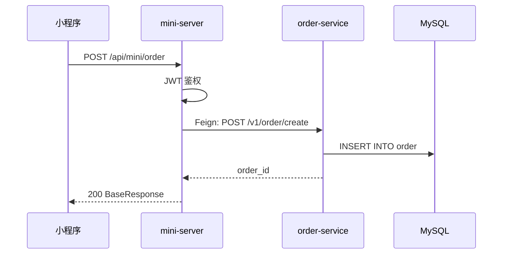

# 核心概念

## 什么是积木

**积木（Block）** 是一个 Markdown 文件，记录一条完整的业务流程。它包含：

```
积木文件 = 元信息 + 流程图 + 节点逻辑 + 异常路径 + 变更记录
```

### 示例：创建订单积木

```markdown
---
id: order_create
name: 创建订单
owner: order-team
status: stable
services: [mini-server, order-service]
triggers: POST /api/mini/order
---

## 流程总览
[Mermaid 序列图]

## 节点逻辑
### mini-server — BFF 编排层
**入口**：MiniController#createOrder
**锚点**：mini-server/src/main/java/.../MiniController.java#createOrder

处理步骤：
1. JWT 鉴权
2. 透传请求参数
3. Feign 调用 order-service

### order-service — 核心业务逻辑
[详细处理步骤]

## 异常路径
[异常场景表格]

## 变更记录
- 2026-05-14: 初始创建
```

## 核心要素

### 1. 元信息（Frontmatter）

```yaml
---
id: order_create              # 唯一标识，通常是文件名
name: 创建订单                # 中文名称
owner: order-team            # 负责团队
status: stable                   # 状态：draft/stable/deprecated
last_modified: 2026-05-14        # 最后修改日期
services: [mini-server, order-service]  # 参与的服务
triggers: POST /api/mini/order     # 触发方式
related_mr: MR-1234             # 相关 MR（可选）
---
```

**字段说明**：
- `id`：文件名（不含 .md），全局唯一
- `status`：
  - `draft` — 草稿，流程还在开发中
  - `stable` — 稳定，已上线运行
  - `deprecated` — 已废弃，保留用于历史追溯
- `services`：按调用顺序列出参与的服务
- `triggers`：如何触发这个流程（HTTP 接口、定时任务、MQ 消息等）

### 2. 流程图（Mermaid）

使用 Mermaid 序列图展示服务间调用关系：



**绘图规范**：
- 参与者（participant）按从左到右的调用顺序排列
- 同步调用用实线箭头 `->>` 
- 异步调用用虚线箭头 `-->>` 并用橙色背景高亮
- 数据库、缓存等基础设施也作为参与者

### 3. 节点逻辑

每个服务的处理细节，包含：

```markdown
### {服务名} — {角色描述}

**入口**：`ClassName#methodName`
**锚点**：`module/src/main/java/path/ClassName.java#methodName`

处理步骤：
1. 步骤1
2. 步骤2
3. 步骤3

**依赖服务**：
- `OrderClient`（→ order-service）

**写表**：order, order_item
**发事件**：无
```

**锚点格式**：`模块名/相对路径#方法名`，用于快速定位代码。

### 4. 异常路径

记录边界情况和错误处理：

| 场景 | 处理 | 返回 |
|------|------|------|
| 订单号重复 | 抛出 ServiceException | "名称已存在" |
| Feign 调用失败 | checkResponse 抛异常 | 下游错误信息 |

### 5. 变更记录

追踪流程演进历史：

```markdown
## 变更记录

- 2026-05-18: 新增门店时间冲突校验（MR-5678）
- 2026-05-14: 初始创建
```

## 积木的粒度

### ✅ 合适的粒度

一个积木 = 一条完整的业务流程（从用户触发到最终响应）

**示例**：
- 创建订单
- 用户下单支付
- 会员注册
- 领取优惠券
- 订单退款

### ❌ 不合适的粒度

**太细**：
- ❌ 参数校验
- ❌ 数据库查询
- ❌ 日志记录

**太粗**：
- ❌ 营销模块
- ❌ 订单系统
- ❌ 会员中心

## 积木的组织

### 目录结构

```
.ai/
├── blocks/                    # 积木文件目录
│   ├── _index.md             # 索引文件
│   ├── _template.md          # 模板文件
│   ├── order_create.md    # 创建订单
│   ├── coupon_receive.md     # 领取优惠券
│   └── order_pay.md          # 订单支付
├── services/                  # 服务档案
├── references/                # 参考资料
└── conventions.md             # 编码约定
```

### 命名规范

积木文件名：`{业务对象}_{动作}.md`

**示例**：
- `order_create.md` — 创建订单
- `coupon_receive.md` — 领取优惠券
- `order_pay.md` — 订单支付
- `member_register.md` — 会员注册

**规则**：
- 全小写
- 单词间用下划线分隔
- 动词在后（create/update/delete/receive/pay）

### 索引文件

`.ai/blocks/_index.md` 是所有积木的目录，按业务域分类：

```markdown
# 积木索引

## 订单
- [创建订单](order_create.md) — 运营后台创建订单
- [更新活动](activity_update.md) — 修改活动配置
- [审核活动](activity_check_status.md) — 审核待上线活动

## 优惠券
- [领取优惠券](coupon_receive.md) — 用户领取优惠券
- [使用优惠券](coupon_use.md) — 下单时使用优惠券

## 订单
- [创建订单](order_create.md) — 用户下单
- [支付订单](order_pay.md) — 订单支付
```

## 积木的生命周期

```
草稿 (draft) → 稳定 (stable) → 废弃 (deprecated)
```

1. **草稿阶段**：功能还在开发中，流程可能变化
2. **稳定阶段**：功能已上线，流程相对固定
3. **废弃阶段**：功能已下线，保留用于历史追溯

## 积木与代码的关系

### 代码驱动文档

```
修改代码 → 更新积木 → 提交 MR → Code Review → 合并
```

积木文件不是独立维护的文档，而是代码的一部分：

- **同步更新**：修改代码时必须同步更新积木
- **版本控制**：积木文件纳入 Git 管理
- **Code Review**：积木更新作为 MR 的一部分被审查

### 锚点机制

每个节点逻辑都有明确的代码锚点：

```
锚点 = 模块名/相对路径#方法名
```

**示例**：
```
order-service/src/main/java/com/freshmart/controller/OrderController.java#create
```

通过锚点可以：
- 快速定位代码位置
- 验证文档与代码的一致性
- 追踪代码变更对流程的影响

## 下一步

- [5分钟快速上手](02-quick-start.md) — 通过实例快速理解积木体系
- [创建积木](../03-operations/01-create-block.md) — 学习如何创建第一个积木
