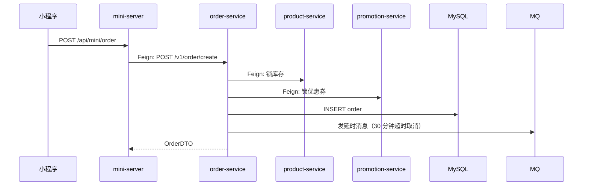

# 5 分钟快速上手

通过一个实际案例，快速理解积木体系的使用方法。

> 本文用本仓库 `examples/fresh-mart`（生鲜电商示例）作为讲解对象。

## 场景：理解"创建订单"流程

假设你是新加入团队的开发者，需要修复"创建订单"功能的一个 bug。

### 第 1 步：找到相关积木

**方式 1：通过索引查找**

打开 `.ai/blocks/_index.md`，搜索"订单"：

```markdown
## 订单 ⭐ 核心复杂流程
- [创建订单](order_create.md) — 跨 5 服务的下单流程，含 try-compensate
- [订单支付](order_pay.md) — 发起支付 + 回调（8 步关键链路）
- [订单退款](order_refund.md) — 跨 5 服务的退款编排（最复杂）
```

**方式 2：直接搜索文件**

```bash
cd .ai/blocks
ls | grep order
# 输出：order_create.md  order_pay.md  order_refund.md
```

**方式 3：询问 Claude / Cursor**

```
你：创建订单的流程是怎样的？
AI：让我查看 order_create 积木...
```

### 第 2 步：阅读积木文件

打开 `.ai/blocks/order_create.md`：

#### 查看元信息

```yaml
---
id: order_create
name: 创建订单（下单）
services: [mini-server, order-service, member-service, product-service, promotion-service]
triggers: POST /api/mini/order
---
```

**快速了解**：

- 涉及 5 个服务（1 个 BFF + 4 个核心服务）
- 入口是 `POST /api/mini/order`

#### 查看流程图



**快速了解**：

- order-service 是编排核心
- 锁库存 + 锁券是 try-compensate 模式
- 延时消息兜底防止订单悬挂

#### 查看节点逻辑

找到你关心的服务节点：

```markdown
### order-service — 订单编排核心

**入口**：`OrderController#create`
**锚点**：`order-service/src/main/java/com/freshmart/controller/OrderController.java#create`

**核心方法**：`OrderService#createOrder`
**锚点**：`order-service/src/main/java/com/freshmart/service/OrderService.java#createOrder`

处理步骤：
1. 调 member-service 校验会员
2. 调 product-service 批量查商品
3. 计算订单总金额
4. INSERT 订单（status=PENDING_LOCK）
5. 调 product-service 锁库存
6. 调 promotion-service 锁券（失败时补偿释放库存）
7. 订单 → PENDING_PAY
8. 发 MQ 延时消息
```

**快速了解**：

- 入口在 `OrderController`
- 核心逻辑在 `OrderService#createOrder`
- 锁券失败时**主动补偿**释放库存

### 第 3 步：定位代码

根据锚点快速跳转到代码：

```
order-service/src/main/java/com/freshmart/service/OrderService.java#createOrder
```

在 IDE 中：

1. 打开 `order-service` 模块
2. 找到 `OrderService.java`
3. 跳转到 `createOrder` 方法

### 第 4 步：理解异常路径

查看积木中的异常路径表格：

| 场景 | 处理 | 返回 |
|------|------|------|
| 库存不足 | 订单 → FAILED | "库存不足" |
| 券不可用 | 补偿释放库存；订单 → FAILED | "优惠券不可用" |
| 30 分钟未支付 | MQ 触发取消，释放库存与券 | 用户重新下单 |

**快速了解**：

- 库存不足直接失败，不需要补偿
- 券不可用要**主动补偿**已锁库存

### 第 5 步：修改代码并更新积木

假设你要新增一个校验：单笔订单金额不能超过 5 万元。

#### 修改代码

在 `OrderService#createOrder` 中新增校验：

```java
// 新增：单笔订单金额限制
if (totalAmount.compareTo(new BigDecimal("50000")) > 0) {
    throw new ServiceException("单笔订单金额不能超过 5 万元");
}
```

#### 更新积木

打开 `.ai/blocks/order_create.md`，更新节点逻辑：

```markdown
处理步骤：
1. 调 member-service 校验会员
2. 调 product-service 批量查商品
3. 计算订单总金额
4. **单笔订单金额校验（新增）** ← 新增这一行
5. INSERT 订单（status=PENDING_LOCK)
...
```

更新异常路径：

| 场景 | 处理 | 返回 |
|------|------|------|
| **单笔金额超过 5 万** | **抛 ServiceException** | **"单笔订单金额不能超过 5 万元"** |

更新变更记录：

```markdown
- 2026-05-24: 新增单笔订单金额限制（MR-310）
- 2026-05-23: 初始创建（MR-301）
```

更新 frontmatter 中的 `last_modified`：

```yaml
last_modified: 2026-05-24
```

### 第 6 步：提交 PR

```bash
git add order-service/src/main/java/com/freshmart/service/OrderService.java
git add .ai/blocks/order_create.md
git commit -m "feat: 单笔订单金额限制 5 万元"
git push origin feature/order-amount-limit
```

PR 描述：

```markdown
## 变更内容
- 单笔订单金额限制 5 万元

## 影响的积木
- order_create.md

## 测试
- [x] 创建 6 万订单 → 返回错误提示
- [x] 创建 4 万订单 → 正常创建
```

## 总结：5 个关键步骤

```
1. 找积木 → 通过索引/搜索/AI 找到相关积木
2. 看流程 → 通过流程图理解服务调用关系
3. 定位码 → 通过锚点快速跳转到代码
4. 改代码 → 实现功能
5. 更积木 → 同步更新积木文件
```

## 常见场景速查

### 场景 1：理解一个功能

```
找积木 → 看流程图 → 看节点逻辑 → 定位代码
```

### 场景 2：修改一个功能

```
找积木 → 理解现有流程 → 修改代码 → 更新积木 → 提交 PR
```

### 场景 3：新增一个功能

```
vibe-blocks new <id> → 画流程图 → 写代码 → 完善积木 → 提交 PR
```

### 场景 4：排查线上问题

```
找积木 → 看异常路径 → 定位可能出错的节点 → 查日志/调试
```

## 下一步

- [新项目初始化](../02-initialization/01-new-project.md) — 用 `vibe-blocks init` 一键搭建
- [创建积木](../03-operations/01-create-block.md) — 详细了解 `vibe-blocks new`
- [更新积木](../03-operations/02-update-block.md) — 学习如何维护积木
