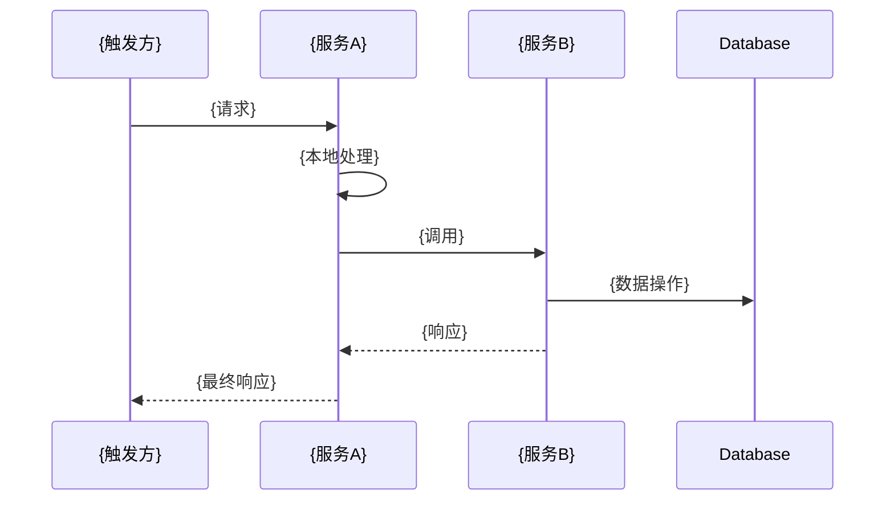
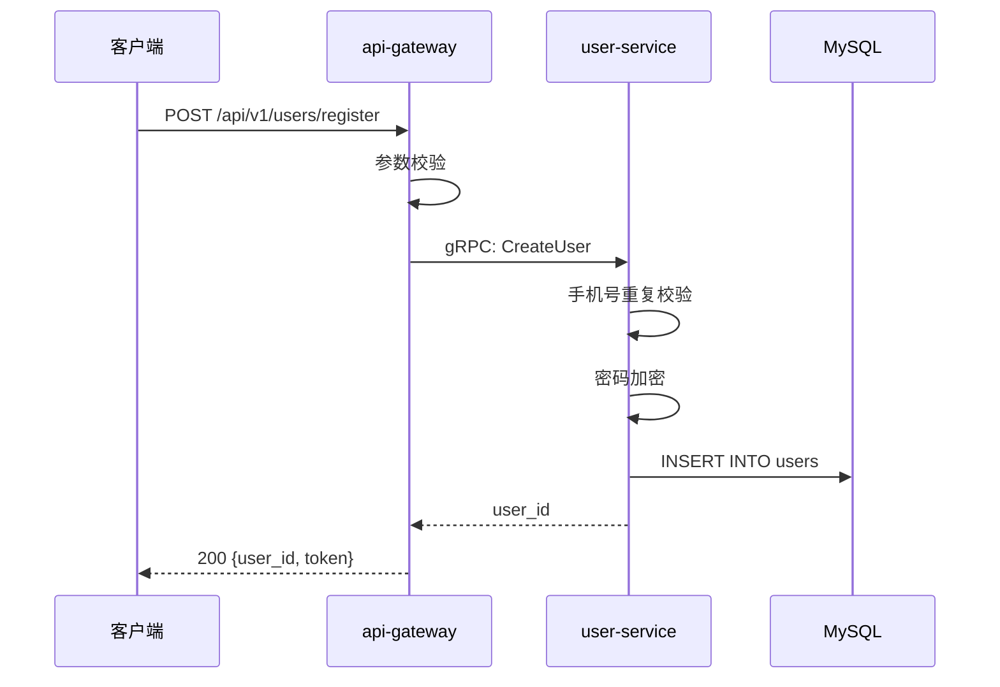
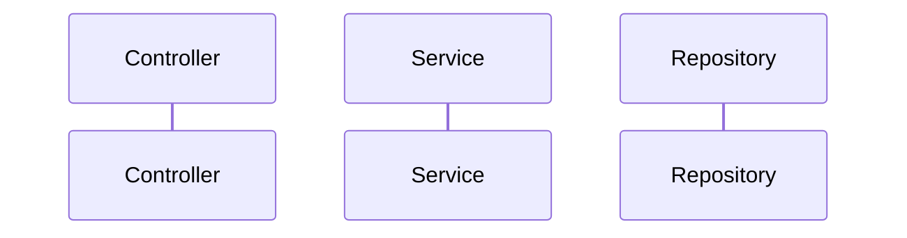

# 新项目初始化指南

为全新项目配置积木体系，从零开始建立业务流程文档化能力。

## 适用场景

- 刚启动的新项目，还没有任何积木文件
- 想从一开始就建立良好的文档习惯
- 团队成员对积木体系有基本了解

## 初始化步骤

### 第1步：创建目录结构

在项目根目录创建 `.ai/` 目录：

```bash
cd your-project
mkdir -p .ai/{blocks,services,references,decisions,prompts}
```

目录说明：
- `blocks/` — 积木文件（业务流程）
- `services/` — 服务档案（每个服务的职责、接口、数据模型）
- `references/` — 参考资料（枚举表、常量、配置说明）
- `decisions/` — 架构决策记录（ADR）
- `prompts/` — AI 工作流模板（可选）

### 第2步：创建配置文件

#### 2.1 创建 CLAUDE.md

在项目根目录创建 `CLAUDE.md`（Claude AI 的项目说明文件）：

```bash
touch CLAUDE.md
```

填入基本信息：

```markdown
# CLAUDE.md — {项目名称}

## 项目概述
{一句话描述项目是什么}

## 技术栈
- 语言：Java 8 / Java 11 / Go / Python
- 框架：Spring Boot / Spring Cloud / Gin / FastAPI
- 数据库：MySQL / PostgreSQL / MongoDB
- 缓存：Redis
- 消息队列：MQ / Kafka / RabbitMQ
- 部署：K8s / Docker

## 架构模式
- {描述你的架构模式，如：微服务 / 单体 / Serverless}
- {描述服务间通信方式，如：HTTP / gRPC / 消息队列}

## 服务列表
| 服务名 | 职责 | 端口 |
|--------|------|------|
| api-gateway | API 网关 | 8080 |
| user-service | 用户服务 | 8081 |
| order-service | 订单服务 | 8082 |

## 编码规范
- {列出你的编码规范}
- {列出你的命名约定}
- {列出你的错误处理约定}

## AI 行为准则

### 先思考再编码
- 实施前明确陈述假设，不确定就问清楚
- 多种解释全部呈现，不私下选择

### 简约优先
- 只写解决问题所需的最小代码
- 不为不可能的情况写错误处理

### 手术式变更
- 只触碰必需之物，不"改进"相邻代码
- 与现有风格保持一致

## AI 知识库
详细的业务积木、服务档案等文档位于 `.ai/` 目录：
- `.ai/blocks/` — 业务流程积木
- `.ai/services/` — 服务档案
- `.ai/references/` — 参考资料
- `.ai/conventions.md` — 编码约定
```

#### 2.2 创建 conventions.md

在 `.ai/` 目录创建 `conventions.md`（编码与积木维护约定）：

```bash
touch .ai/conventions.md
```

填入内容：

```markdown
# 编码与积木维护约定

## 积木维护规则

每次修改涉及业务流程的代码时，必须同步更新对应积木文件：

1. **找到受影响的积木**：根据修改文件的路径匹配锚点
2. **更新节点逻辑**：如果处理步骤变了
3. **更新 mermaid 图**：如果调用链变了
4. **追加变更记录**：一行说明改了什么 + MR 号
5. **如果是新流程**：创建新积木文件，注册到 `_index.md`

### 不需要更新积木的情况

- 纯重构（逻辑不变，只是代码结构调整）
- bug fix 且不改变流程语义
- 仅修改日志、注释

## 积木粒度标准

一个积木 = 一条完整的业务流程（从用户触发到最终响应）

粒度参考：
- ✅ 创建订单、用户注册、发送通知
- ❌ "参数校验"（太细）、"订单模块"（太粗）

## 代码分层约定

{根据你的项目填写，示例：}

```
Controller（入口） → Service（业务编排） → Repository（数据访问）
```

## 服务间通信约定

{根据你的项目填写，示例：}

- 使用 gRPC 进行同步调用
- 使用 Kafka 进行异步消息传递
- 响应统一使用 protobuf 定义的消息格式

## 错误处理约定

{根据你的项目填写}

## 命名约定

{根据你的项目填写}
```

#### 2.3 创建 OVERVIEW.md

在 `.ai/` 目录创建 `OVERVIEW.md`（项目全景概述）：

```bash
touch .ai/OVERVIEW.md
```

填入内容：

```markdown
# {项目名称} 项目全貌

## 这个项目是什么

{一段话描述项目的业务价值}

## 技术栈

{列出技术栈}

## 服务拓扑

```
{画出服务调用关系图}
```

## 模块职责速查

| 模块 | 类型 | 职责 |
|------|------|------|
| api-gateway | 网关 | 路由、鉴权 |
| user-service | 核心服务 | 用户管理 |

## 目录结构约定

{描述你的目录结构}

## 认证体系

{描述你的认证方式}
```

### 第3步：创建积木模板

在 `.ai/blocks/` 目录创建模板文件：

```bash
touch .ai/blocks/_template.md
```

填入内容（复制下面的模板）：

```markdown
---
id: {flow_id}
name: {流程中文名}
owner: {负责团队}
status: draft | stable | deprecated
last_modified: {YYYY-MM-DD}
services: [{参与的服务列表}]
triggers: {触发方式，如 POST /api/xxx}
related_mr: {最近相关MR}
---

## 流程总览



## 节点逻辑

### {服务A} — {角色描述}

**入口**：`{ClassName}#{methodName}`
**锚点**：`{模块}/src/main/java/{path}#{method}`

处理步骤：
1. {步骤1}
2. {步骤2}
3. {步骤3}

**依赖服务**：
- `{Client}`（→ {目标服务}）

---

### {服务B} — {角色描述}

**入口**：`{ClassName}#{methodName}`
**锚点**：`{模块}/src/main/java/{path}#{method}`

**事务**：`@Transactional`（如有）

处理步骤：
1. {步骤1}
2. {步骤2}

**写表**：{涉及的数据库表}
**发事件**：{发布的消息/事件，如无写"无"}

## 异常路径

| 场景 | 处理 | 返回 |
|------|------|------|
| {异常场景1} | {处理方式} | {返回信息} |
| {异常场景2} | {处理方式} | {返回信息} |

## 变更记录

- {YYYY-MM-DD}: {变更说明}（{MR号}）
```

### 第4步：创建索引文件

在 `.ai/blocks/` 目录创建索引文件：

```bash
touch .ai/blocks/_index.md
```

填入初始内容：

```markdown
# 积木索引

本文件是所有业务流程积木的目录，按业务域分类。

## 用户模块
- [用户注册](user_register.md) — 新用户注册流程
- [用户登录](user_login.md) — 用户登录认证

## 订单模块
- [创建订单](order_create.md) — 用户下单流程
- [支付订单](order_pay.md) — 订单支付流程

---

**维护规则**：
- 新增积木时，必须在此文件中添加索引
- 按业务域分类，保持分类清晰
- 每个积木一行，格式：`- [中文名](文件名.md) — 简短描述`
```

### 第5步：配置 Git 忽略

确保 `.ai/` 目录被纳入版本控制，但排除临时文件：

编辑 `.gitignore`：

```bash
# 不要忽略 .ai 目录
!.ai/

# 但忽略临时文件
.ai/**/*.tmp
.ai/**/*.bak
.ai/**/.DS_Store
```

### 第6步：提交初始化文件

```bash
git add .ai/ CLAUDE.md
git commit -m "chore: 初始化积木体系"
git push origin main
```

## 第一个积木

现在你可以创建第一个积木了！

### 示例：创建"用户注册"积木

```bash
cd .ai/blocks
cp _template.md user_register.md
```

编辑 `user_register.md`，填入实际内容：

```markdown
---
id: user_register
name: 用户注册
owner: user-team
status: draft
last_modified: 2026-05-18
services: [api-gateway, user-service]
triggers: POST /api/v1/users/register
---

## 流程总览



## 节点逻辑

### api-gateway — 入口层

**入口**：`UserController#register`
**锚点**：`api-gateway/src/main/java/com/example/controller/UserController.java#register`

处理步骤：
1. 参数校验（手机号格式、密码强度）
2. 调用 user-service 的 CreateUser 接口
3. 生成 JWT token
4. 返回用户 ID 和 token

**依赖服务**：
- `UserServiceClient`（→ user-service）

---

### user-service — 核心业务逻辑

**入口**：`UserService#createUser`
**锚点**：`user-service/src/main/java/com/example/service/UserService.java#createUser`

**事务**：`@Transactional`

处理步骤：
1. 手机号重复校验
2. 密码加密（BCrypt）
3. 创建用户实体
4. 持久化到数据库
5. 发送欢迎短信（异步）

**写表**：users
**发事件**：user.registered（Kafka）

## 异常路径

| 场景 | 处理 | 返回 |
|------|------|------|
| 手机号已注册 | 抛出 DuplicateException | "手机号已注册" |
| 密码强度不足 | 抛出 ValidationException | "密码必须包含字母和数字" |

## 变更记录

- 2026-05-18: 初始创建
```

更新索引文件 `_index.md`：

```markdown
## 用户模块
- [用户注册](user_register.md) — 新用户注册流程  ← 新增这一行
```

提交：

```bash
git add .ai/blocks/user_register.md .ai/blocks/_index.md
git commit -m "docs: 新增用户注册积木"
git push
```

## 团队协作配置

### 配置 Code Review 检查清单

在项目根目录创建 `.github/PULL_REQUEST_TEMPLATE.md`（或对应的 GitLab 模板）：

```markdown
## 变更内容
{描述你的变更}

## 影响的积木
- [ ] 无积木受影响
- [ ] 已更新以下积木：
  - [ ] {积木文件名}

## 测试
- [ ] 单元测试通过
- [ ] 集成测试通过
- [ ] 手动测试通过

## 检查清单
- [ ] 代码符合编码规范
- [ ] 积木文件已同步更新（如适用）
- [ ] 变更记录已追加
- [ ] 索引文件已更新（如新增积木）
```

### 配置 CI 检查

在 CI 配置中添加积木一致性检查（可选）：

```yaml
# .github/workflows/ci.yml
name: CI

on: [push, pull_request]

jobs:
  check-blocks:
    runs-on: ubuntu-latest
    steps:
      - uses: actions/checkout@v2
      - name: Check block consistency
        run: |
          # 检查是否有新增的 Java 文件但没有更新积木
          # 这是一个简单示例，可以根据需要扩展
          if git diff --name-only HEAD~1 | grep -q '\.java$'; then
            echo "检测到 Java 文件变更，请确认是否需要更新积木"
          fi
```

## 下一步

- [创建积木](../03-operations/01-create-block.md) — 学习如何创建更多积木
- [团队协作流程](../04-collaboration/01-team-workflow.md) — 建立团队协作规范
- [老项目接入](02-existing-project.md) — 如果你有老项目需要接入积木体系

## 常见问题

### Q: 我的项目不是 Java，怎么办？
A: 积木体系与语言无关，只需调整锚点格式。例如 Go 项目：
```
锚点：module/pkg/service/user.go#CreateUser
```

### Q: 我的项目是单体应用，不是微服务，怎么办？
A: 积木体系同样适用，只是流程图中的参与者变成不同的模块/包：


### Q: 我需要为每个接口都创建积木吗？
A: 不需要。只为**完整的业务流程**创建积木，简单的 CRUD 操作不需要。
