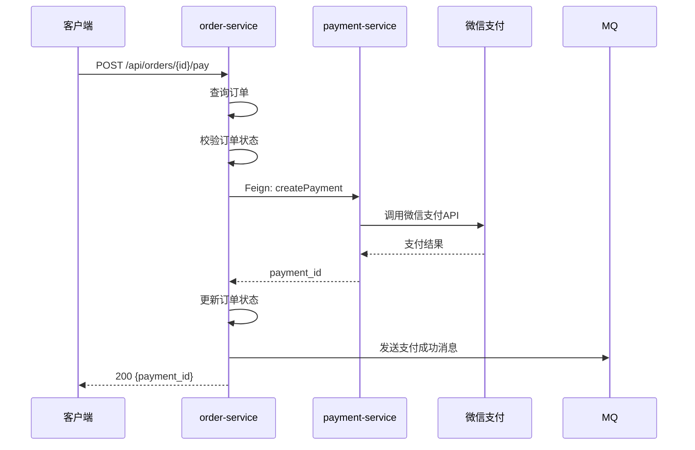

# 老项目接入指南

为已有项目引入积木体系，逐步建立业务流程文档化能力。

## 适用场景

- 项目已运行一段时间，有一定的代码积累
- 团队成员对业务流程不够清晰
- 新人上手困难，缺少文档
- 想改善文档与代码脱节的问题

## 接入策略

老项目接入积木体系，建议采用**渐进式接入**策略：

```
第1阶段：搭建框架（1天）
    ↓
第2阶段：梳理核心流程（1-2周）
    ↓
第3阶段：全面推广（持续）
```

不要试图一次性梳理所有流程，而是从最重要的流程开始，逐步完善。

## 第1阶段：搭建框架（1天）

### 步骤1：创建目录结构

```bash
cd your-existing-project
mkdir -p .ai/{blocks,services,references,decisions}
```

### 步骤2：创建配置文件

参考 [新项目初始化指南](01-new-project.md) 的第2步，创建：
- `CLAUDE.md` — 项目说明文件
- `.ai/conventions.md` — 编码与积木维护约定
- `.ai/OVERVIEW.md` — 项目全景概述
- `.ai/blocks/_template.md` — 积木模板
- `.ai/blocks/_index.md` — 积木索引

**关键差异**：老项目的 `OVERVIEW.md` 需要根据现有代码填写，可以让 Claude AI 帮你生成：

```
你：帮我分析这个项目的架构，生成 OVERVIEW.md
Claude：[分析代码结构，生成文档]
```

### 步骤3：提交初始化文件

```bash
git add .ai/ CLAUDE.md
git commit -m "chore: 引入积木体系"
git push origin main
```

## 第2阶段：梳理核心流程（1-2周）

### 确定优先级

不要试图一次性梳理所有流程，按优先级分批进行：

#### P0：核心业务流程（必须梳理）

选择标准：
- 最常被修改的流程
- 新人最常问的流程
- 最容易出问题的流程
- 业务价值最高的流程

**示例**：
- 电商系统：下单支付、退款
- 会员系统：注册、充值、积分兑换
- 营销系统：创建活动、发券、核销

**数量**：3-5 个流程

#### P1：重要业务流程（逐步梳理）

选择标准：
- 使用频率较高的流程
- 涉及多个服务的复杂流程
- 有一定技术难度的流程

**数量**：10-15 个流程

#### P2：次要流程（按需梳理）

选择标准：
- 使用频率低的流程
- 逻辑简单的 CRUD 操作
- 辅助功能

**数量**：不限，按需添加

### 梳理方法

#### 方法1：从代码逆向梳理（推荐）

适合：代码质量较好，逻辑清晰的项目

步骤：
1. 找到流程的入口（Controller 或 API 接口）
2. 跟踪代码调用链，记录每个服务的处理步骤
3. 画出 Mermaid 序列图
4. 填写节点逻辑和锚点
5. 补充异常路径

**工具辅助**：
```
你：帮我梳理"创建订单"流程，入口是 OrderController#createOrder
Claude：[分析代码，生成积木文件]
```

#### 方法2：从需求正向梳理

适合：代码质量一般，需要重新理解业务的项目

步骤：
1. 找到需求文档或产品原型
2. 根据需求画出理想的流程图
3. 对照代码，验证实际实现
4. 记录差异（需求与实现不一致的地方）
5. 填写积木文件

#### 方法3：从问题倒推梳理

适合：经常出问题的流程

步骤：
1. 收集最近的线上问题
2. 分析问题涉及的流程
3. 梳理问题流程的完整链路
4. 标注容易出错的节点
5. 填写积木文件，重点补充异常路径

### 梳理示例

假设你要梳理"订单支付"流程：

#### 第1步：找到入口

```bash
# 搜索支付相关的 Controller
grep -r "pay" --include="*Controller.java"
# 找到：OrderController#payOrder
```

#### 第2步：跟踪调用链

```java
// OrderController#payOrder
public BaseResponse payOrder(PayRequest request) {
    // 1. 参数校验
    // 2. 调用 OrderService
    return orderService.pay(request);
}

// OrderService#pay
public void pay(PayRequest request) {
    // 1. 查询订单
    // 2. 校验订单状态
    // 3. 调用支付服务
    paymentClient.createPayment(request);
    // 4. 更新订单状态
    // 5. 发送支付成功消息
}

// PaymentService#createPayment
public PaymentResult createPayment(PayRequest request) {
    // 1. 创建支付单
    // 2. 调用第三方支付（微信/支付宝）
    // 3. 返回支付结果
}
```

#### 第3步：画流程图



#### 第4步：创建积木文件

```bash
cd .ai/blocks
cp _template.md order_pay.md
```

填入内容（参考模板）。

#### 第5步：更新索引

编辑 `.ai/blocks/_index.md`：

```markdown
## 订单模块
- [创建订单](order_create.md) — 用户下单流程
- [支付订单](order_pay.md) — 订单支付流程  ← 新增
```

#### 第6步：提交

```bash
git add .ai/blocks/order_pay.md .ai/blocks/_index.md
git commit -m "docs: 新增订单支付积木"
git push
```

### 批量梳理技巧

如果要梳理多个流程，可以：

1. **先画流程图，后填细节**：快速画出所有核心流程的序列图，再逐个补充节点逻辑
2. **团队分工**：每人负责梳理自己熟悉的模块
3. **利用 AI**：让 Claude 帮你生成初稿，再人工校对

## 第3阶段：全面推广（持续）

### 建立团队规范

#### 1. 更新 Code Review 检查清单

在 MR 模板中添加积木检查项：

```markdown
## 影响的积木
- [ ] 无积木受影响
- [ ] 已更新以下积木：
  - [ ] {积木文件名}
- [ ] 已创建新积木（如适用）
```

#### 2. 制定积木维护规则

在团队文档中明确：

- **什么时候需要更新积木**：修改业务流程时
- **什么时候需要创建积木**：新增业务流程时
- **什么时候不需要更新积木**：纯重构、bug fix（不改流程）

#### 3. 定期 Review

每月或每季度 Review 一次积木文件：

- 检查是否有过时的积木（status 改为 deprecated）
- 检查是否有遗漏的流程
- 检查积木质量（流程图是否清晰、锚点是否准确）

### 培训新人

新人入职时：

1. **第1天**：阅读 `CLAUDE.md` 和 `.ai/OVERVIEW.md`，了解项目全貌
2. **第1周**：阅读核心流程的积木文件，理解业务
3. **第2周**：修改代码时，尝试更新积木文件
4. **第1个月**：独立创建第一个积木文件

### 持续改进

- **收集反馈**：定期询问团队成员，积木体系是否有帮助
- **优化模板**：根据实际使用情况，调整积木模板
- **工具增强**：开发脚本或工具，辅助积木维护

## 常见问题

### Q: 老项目代码质量差，很难梳理怎么办？

A: 分两步走：
1. 先梳理**理想流程**（根据需求文档）
2. 在积木中标注**实际实现与理想流程的差异**
3. 后续重构时，以积木为目标，逐步对齐

### Q: 项目太大，流程太多，梳理不过来怎么办？

A: 不要追求完美，采用**二八原则**：
- 先梳理 20% 的核心流程（覆盖 80% 的业务价值）
- 其他流程按需梳理（有人问或要修改时再梳理）

### Q: 团队成员不愿意维护积木怎么办？

A: 几个建议：
1. **从上而下推动**：Leader 以身作则，Code Review 时检查积木
2. **降低门槛**：提供模板和工具，让维护变简单
3. **展示价值**：分享积木帮助新人快速上手的案例
4. **纳入考核**：将积木维护纳入绩效考核（可选）

### Q: 积木文件和代码不一致怎么办？

A: 建立**定期校验机制**：
1. 每月 Review 一次积木文件
2. 对照代码，检查锚点是否准确
3. 更新过时的积木，标记废弃的积木

### Q: 我们用的不是 Java，锚点格式怎么写？

A: 根据语言调整：

**Go**：
```
锚点：module/pkg/service/user.go#CreateUser
```

**Python**：
```
锚点：module/service/user.py#create_user
```

**Node.js**：
```
锚点：src/services/user.service.ts#createUser
```

## 成功案例

### 案例1：fresh-mart 案例

**背景**：
- 项目运行 2 年，代码 10 万行+
- 微服务架构，10+ 个服务
- 新人上手需要 1-2 个月

**接入过程**：
1. 第1周：搭建框架，梳理 5 个核心流程
2. 第2-4周：团队分工，梳理 20 个重要流程
3. 第2个月：全面推广，新功能必须创建积木

**效果**：
- 新人上手时间缩短到 2 周
- 线上问题排查效率提升 50%
- 代码与文档同步率 90%+

## 下一步

- [创建积木](../03-operations/01-create-block.md) — 学习如何创建积木
- [更新积木](../03-operations/02-update-block.md) — 学习如何维护积木
- [团队协作流程](../04-collaboration/01-team-workflow.md) — 建立团队协作规范
