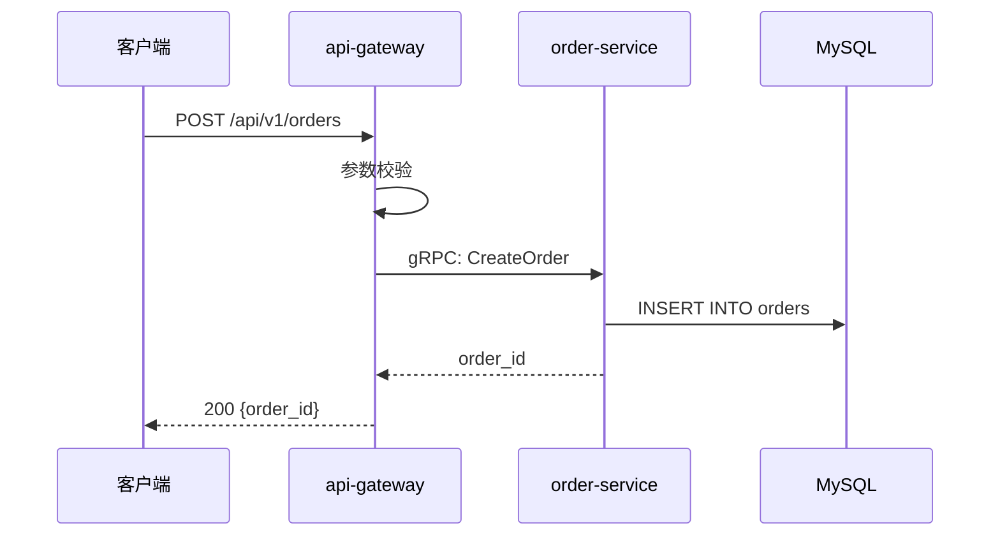
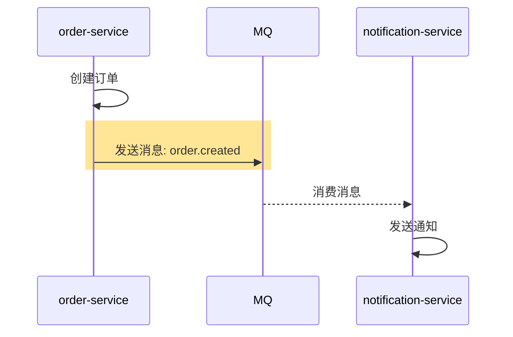
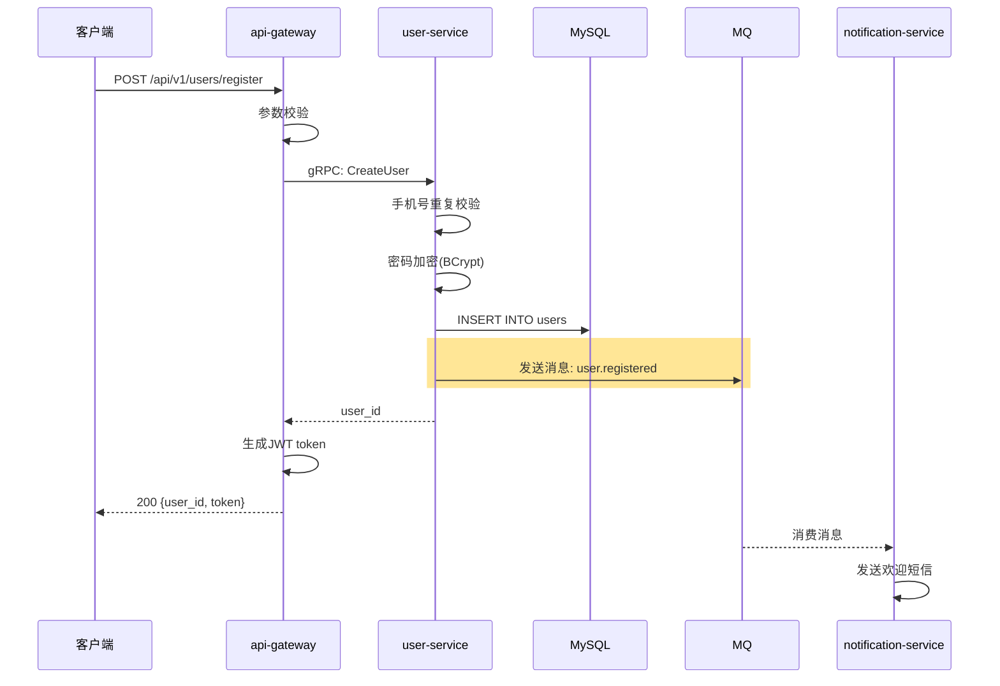

# 创建积木

学习如何为新的业务流程创建积木文件。

## 什么时候创建积木

### 必须创建

- ✅ 新增了一条完整的业务流程
- ✅ 涉及多个服务的复杂流程
- ✅ 核心业务功能

### 不需要创建

- ❌ 简单的 CRUD 操作（单表增删改查）
- ❌ 纯工具类方法
- ❌ 内部辅助函数

### 判断标准

问自己：**如果新人要理解这个功能，需要跨多个文件/服务吗？**

- 如果是 → 创建积木
- 如果否 → 不需要积木

## 创建步骤

### 第1步：确定积木信息

在开始写代码之前，先明确：

1. **流程名称**：用一句话描述这个流程做什么
   - ✅ 创建营销活动
   - ✅ 用户下单支付
   - ❌ 处理订单（太模糊）

2. **触发方式**：这个流程如何被触发
   - HTTP 接口：`POST /api/orders`
   - 定时任务：`Cron: 0 0 * * *`
   - MQ 消息：`Topic: order.created`

3. **参与服务**：这个流程涉及哪些服务
   - 按调用顺序列出：`[api-gateway, order-service, payment-service]`

4. **负责团队**：哪个团队负责维护这个流程
   - 例如：`order-team`、`payment-team`

### 第2步：复制模板

```bash
cd .ai/blocks
cp _template.md {业务对象}_{动作}.md
```

**命名规范**：
- 全小写
- 单词间用下划线分隔
- 格式：`{业务对象}_{动作}.md`

**示例**：
```bash
cp _template.md order_create.md      # 创建订单
cp _template.md coupon_receive.md    # 领取优惠券
cp _template.md member_upgrade.md    # 会员升级
```

### 第3步：填写元信息

编辑文件，填写 Frontmatter：

```yaml
---
id: order_create                     # 文件名（不含.md）
name: 创建订单                        # 中文名称
owner: order-team                    # 负责团队
status: draft                        # 初始状态为 draft
last_modified: 2026-05-18            # 今天的日期
services: [api-gateway, order-service, inventory-service]  # 参与的服务
triggers: POST /api/v1/orders        # 触发方式
---
```

**字段说明**：
- `status`：新积木初始状态为 `draft`，上线后改为 `stable`
- `services`：按调用顺序列出，从入口到最底层
- `triggers`：写清楚完整的触发路径

### 第4步：画流程图

使用 Mermaid 序列图展示服务间调用关系。

#### 基本语法



#### 绘图规范

1. **参与者（participant）**：
   - 按从左到右的调用顺序排列
   - 使用简短的别名（as 后面的名称）
   - 数据库、缓存、MQ 也作为参与者

2. **箭头类型**：
   - 同步调用：实线箭头 `->>` 
   - 异步返回：虚线箭头 `-->>` 
   - 异步消息：虚线箭头 `-->>` 并用橙色背景高亮

3. **消息标签**：
   - 写清楚调用的接口或方法
   - HTTP 调用：`POST /api/xxx`
   - RPC 调用：`gRPC: MethodName` 或 `Feign: MethodName`
   - 数据库操作：`INSERT INTO table` 或 `SELECT FROM table`

4. **本地处理**：
   - 服务内部的处理步骤：`A->>A: 参数校验`

#### 异步调用标记

如果有异步消息（MQ、Kafka 等），需要特殊标记：



**关键点**：
- 声明 MQ 参与者：`participant MQ as MQ`
- 用 `rect rgb(255, 230, 150)` 包裹异步发送行（橙色背景）

### 第5步：填写节点逻辑

为每个服务填写详细的处理步骤。

#### 模板

```markdown
### {服务名} — {角色描述}

**入口**：`ClassName#methodName`
**锚点**：`module/src/main/java/path/ClassName.java#methodName`

处理步骤：
1. {步骤1}
2. {步骤2}
3. {步骤3}

**依赖服务**：
- `ClientName`（→ target-service）

**写表**：{涉及的数据库表，多个用逗号分隔}
**发事件**：{发布的消息/事件，如无写"无"}
```

#### 示例

```markdown
### order-service — 核心业务逻辑

**入口**：`OrderController#createOrder`
**锚点**：`order-service/src/main/java/com/example/controller/OrderController.java#createOrder`

**核心方法**：`OrderService#create`
**锚点**：`order-service/src/main/java/com/example/service/OrderService.java#create`

**事务**：`@Transactional`

处理步骤：
1. 参数校验（商品ID、数量、收货地址）
2. 查询商品信息（价格、库存）
3. 计算订单金额（商品价格 × 数量 + 运费）
4. 调用库存服务扣减库存
5. 创建订单实体
6. 持久化到数据库
7. 发送订单创建消息（异步）

**依赖服务**：
- `InventoryClient`（→ inventory-service）

**写表**：orders, order_items
**发事件**：order.created（MQ）
```

#### 填写技巧

1. **锚点要准确**：
   - 格式：`模块名/相对路径#方法名`
   - 确保路径可以直接定位到代码

2. **步骤要清晰**：
   - 按执行顺序列出
   - 每个步骤一句话说清楚
   - 关键的业务逻辑要详细说明

3. **依赖要明确**：
   - 列出所有调用的下游服务
   - 写清楚 Client 名称和目标服务

4. **数据操作要记录**：
   - 写表：列出所有写入的表
   - 发事件：列出所有发布的消息

### 第6步：填写异常路径

记录边界情况和错误处理。

#### 模板

| 场景 | 处理 | 返回 |
|------|------|------|
| {异常场景1} | {处理方式} | {返回信息} |
| {异常场景2} | {处理方式} | {返回信息} |

#### 示例

| 场景 | 处理 | 返回 |
|------|------|------|
| 商品不存在 | 抛出 NotFoundException | "商品不存在" |
| 库存不足 | 抛出 InsufficientStockException | "库存不足" |
| 用户余额不足 | 抛出 InsufficientBalanceException | "余额不足，请充值" |
| 下游服务调用失败 | 抛出 ServiceException | 下游错误信息 |

#### 填写技巧

1. **覆盖主要异常**：
   - 业务异常（库存不足、余额不足）
   - 技术异常（服务调用失败、数据库异常）
   - 参数异常（参数缺失、格式错误）

2. **说明处理方式**：
   - 抛出异常
   - 返回错误码
   - 降级处理
   - 重试

3. **写清楚返回信息**：
   - 用户看到的错误提示
   - 或者错误码

### 第7步：添加变更记录

在文件末尾添加初始变更记录：

```markdown
## 变更记录

- 2026-05-18: 初始创建
```

### 第8步：更新索引

编辑 `.ai/blocks/_index.md`，添加新积木的索引：

```markdown
## 订单模块
- [创建订单](order_create.md) — 用户下单流程  ← 新增这一行
```

**索引格式**：
```markdown
- [中文名](文件名.md) — 简短描述（一句话）
```

### 第9步：提交代码

```bash
git add .ai/blocks/order_create.md .ai/blocks/_index.md
git commit -m "docs: 新增创建订单积木"
git push origin feature/order-create
```

**提交信息规范**：
- 类型：`docs`
- 描述：`新增 {流程名} 积木`

## 完整示例

### 场景：创建"用户注册"积木

#### 1. 确定信息

- 流程名称：用户注册
- 触发方式：`POST /api/v1/users/register`
- 参与服务：`[api-gateway, user-service, notification-service]`
- 负责团队：`user-team`

#### 2. 创建文件

```bash
cd .ai/blocks
cp _template.md user_register.md
```

#### 3. 填写内容

```markdown
---
id: user_register
name: 用户注册
owner: user-team
status: draft
last_modified: 2026-05-18
services: [api-gateway, user-service, notification-service]
triggers: POST /api/v1/users/register
---

## 流程总览



## 节点逻辑

### api-gateway — 入口层

**入口**：`UserController#register`
**锚点**：`api-gateway/src/main/java/com/example/controller/UserController.java#register`

处理步骤：
1. 参数校验（手机号格式、密码强度）
2. 调用 user-service 的 CreateUser 接口
3. 生成 JWT token
4. 返回用户 ID 和 token

**依赖服务**：
- `UserServiceClient`（→ user-service）

---

### user-service — 核心业务逻辑

**入口**：`UserService#createUser`
**锚点**：`user-service/src/main/java/com/example/service/UserService.java#createUser`

**事务**：`@Transactional`

处理步骤：
1. 手机号重复校验（查询 users 表）
2. 密码加密（BCrypt，强度 10）
3. 创建用户实体（设置默认头像、昵称）
4. 持久化到数据库
5. 发送用户注册消息（异步）

**写表**：users
**发事件**：user.registered（MQ）

---

### notification-service — 通知服务

**入口**：`UserEventListener#onUserRegistered`
**锚点**：`notification-service/src/main/java/com/example/listener/UserEventListener.java#onUserRegistered`

处理步骤：
1. 消费 user.registered 消息
2. 查询用户手机号
3. 调用短信服务发送欢迎短信
4. 记录发送日志

**写表**：notification_logs
**发事件**：无

## 异常路径

| 场景 | 处理 | 返回 |
|------|------|------|
| 手机号已注册 | 抛出 DuplicateException | "手机号已注册" |
| 密码强度不足 | 抛出 ValidationException | "密码必须包含字母和数字，长度8-20位" |
| 短信发送失败 | 记录日志，不影响注册 | 注册成功，短信发送失败 |
| 数据库异常 | 抛出 ServiceException | "系统繁忙，请稍后重试" |

## 变更记录

- 2026-05-18: 初始创建
```

#### 4. 更新索引

编辑 `.ai/blocks/_index.md`：

```markdown
## 用户模块
- [用户注册](user_register.md) — 新用户注册流程  ← 新增
- [用户登录](user_login.md) — 用户登录认证
```

#### 5. 提交

```bash
git add .ai/blocks/user_register.md .ai/blocks/_index.md
git commit -m "docs: 新增用户注册积木"
git push
```

## 常见问题

### Q: 流程图太复杂，画不下怎么办？

A: 几个建议：
1. **简化细节**：流程图只画主流程，细节放在节点逻辑中
2. **拆分积木**：如果流程确实很复杂，考虑拆分成多个积木
3. **使用子图**：Mermaid 支持 `rect` 分组，可以将相关步骤分组

### Q: 锚点写错了怎么办？

A: 提交前检查：
1. 在 IDE 中打开文件，确认路径正确
2. 跳转到方法，确认方法名正确
3. 如果写错了，修改后重新提交

### Q: 我不确定某个步骤的处理逻辑，怎么办？

A: 几个方法：
1. **看代码**：直接看代码实现
2. **问同事**：问负责这个模块的同事
3. **先写草稿**：标记为 `status: draft`，后续完善
4. **问 Claude**：让 Claude 帮你分析代码

### Q: 积木文件太长，怎么办？

A: 如果超过 500 行，考虑：
1. **简化流程图**：只画主流程
2. **精简节点逻辑**：只写关键步骤
3. **拆分积木**：将复杂流程拆分成多个子流程

## 下一步

- [更新积木](02-update-block.md) — 学习如何维护积木
- [使用积木](03-use-block.md) — 学习如何查找和使用积木
