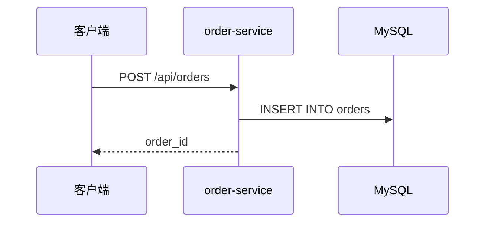
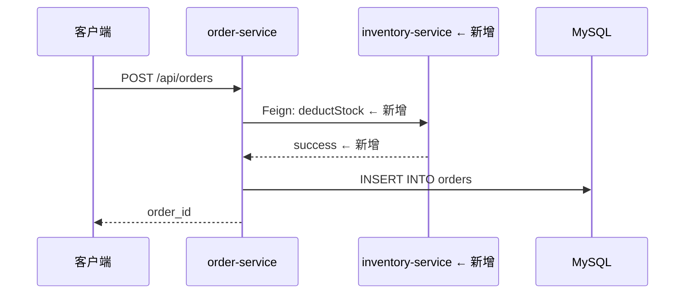
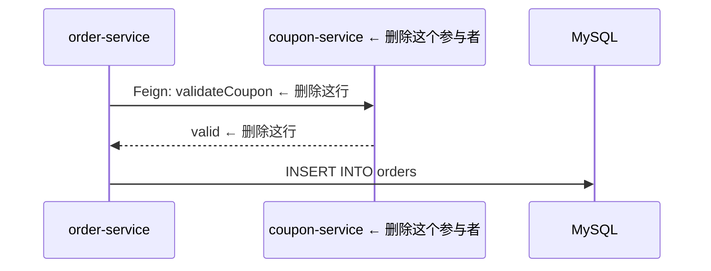
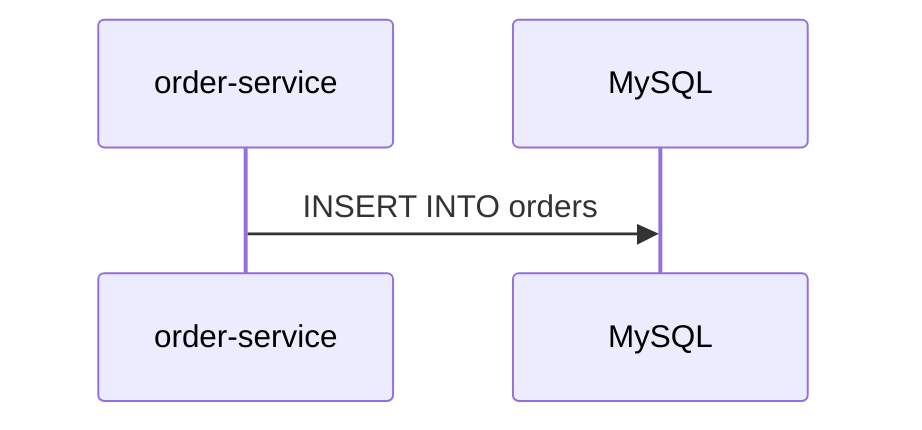
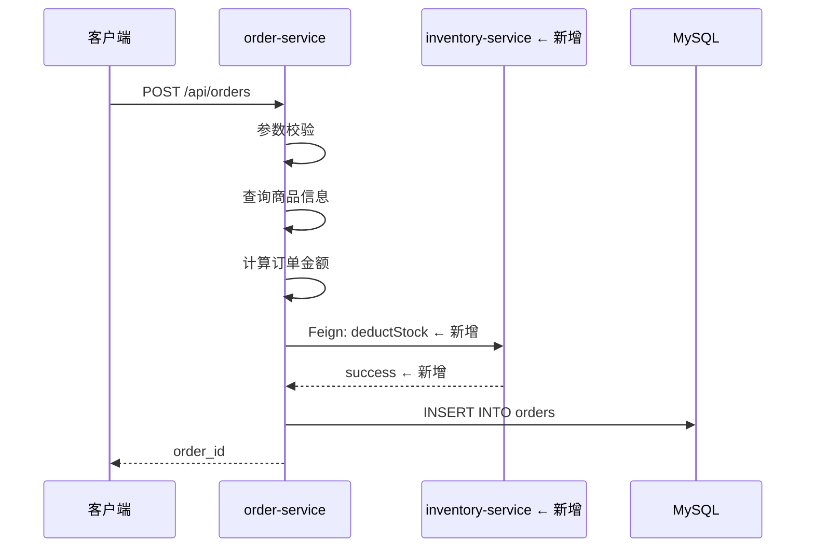

# 更新积木

学习如何维护和更新现有的积木文件，保持文档与代码同步。

## 什么时候更新积木

### 必须更新

- ✅ 修改了业务流程的处理步骤
- ✅ 新增或删除了服务间调用
- ✅ 修改了异常处理逻辑
- ✅ 修改了数据库表结构（影响流程的）
- ✅ 修改了消息格式或 Topic

### 不需要更新

- ❌ 纯代码重构（逻辑不变）
- ❌ 修改日志、注释
- ❌ 修改变量名、方法名（不影响流程）
- ❌ Bug fix 且不改变流程语义

### 判断标准

问自己：**如果不更新积木，新人看积木能理解当前的流程吗？**

- 如果不能 → 必须更新
- 如果能 → 不需要更新

## 更新步骤

### 第1步：找到受影响的积木

根据你修改的代码文件，找到对应的积木。

#### 方法1：通过锚点反查

如果你修改了 `OrderService.java#createOrder` 方法：

```bash
cd .ai/blocks
grep -r "OrderService.java#createOrder" .
# 输出：order_create.md:**锚点**：order-service/.../OrderService.java#createOrder
```

#### 方法2：通过索引查找

打开 `.ai/blocks/_index.md`，搜索相关模块：

```markdown
## 订单模块
- [创建订单](order_create.md) — 用户下单流程  ← 找到这个
```

#### 方法3：询问 Claude

```
你：我修改了 OrderService 的 createOrder 方法，需要更新哪个积木？
Claude：需要更新 order_create.md
```

### 第2步：确定更新内容

根据代码变更，确定需要更新积木的哪些部分：

| 代码变更 | 需要更新的部分 |
|----------|----------------|
| 新增/删除服务调用 | 流程图 + 节点逻辑 + 元信息(services) |
| 修改处理步骤 | 节点逻辑 |
| 新增/修改异常处理 | 异常路径表格 |
| 修改数据库表 | 节点逻辑（写表字段） |
| 修改消息格式 | 节点逻辑（发事件字段） |
| 修改入口方法 | 节点逻辑（锚点） |

### 第3步：更新流程图（如需要）

如果服务间调用关系变了，需要更新 Mermaid 序列图。

#### 场景1：新增服务调用

**代码变更**：订单创建时新增库存扣减

**原流程图**：


**新流程图**：


#### 场景2：删除服务调用

**代码变更**：移除了优惠券校验（改为前端校验）

**原流程图**：


**新流程图**：


#### 场景3：修改调用顺序

**代码变更**：先扣库存，再创建订单（原来是先创建订单，再扣库存）

调整流程图中的箭头顺序即可。

### 第4步：更新节点逻辑

根据代码变更，更新对应服务的处理步骤。

#### 场景1：新增处理步骤

**代码变更**：订单创建时新增风控校验

**原节点逻辑**：
```markdown
处理步骤：
1. 参数校验
2. 查询商品信息
3. 计算订单金额
4. 创建订单实体
5. 持久化到数据库
```

**新节点逻辑**：
```markdown
处理步骤：
1. 参数校验
2. 查询商品信息
3. 计算订单金额
4. **风控校验（新增）** ← 新增这一行
5. 创建订单实体
6. 持久化到数据库
```

#### 场景2：修改处理步骤

**代码变更**：密码加密算法从 MD5 改为 BCrypt

**原节点逻辑**：
```markdown
处理步骤：
1. 手机号重复校验
2. 密码加密（MD5）  ← 修改这一行
3. 创建用户实体
```

**新节点逻辑**：
```markdown
处理步骤：
1. 手机号重复校验
2. 密码加密（BCrypt，强度 10）  ← 修改后
3. 创建用户实体
```

#### 场景3：删除处理步骤

**代码变更**：移除了优惠券校验

**原节点逻辑**：
```markdown
处理步骤：
1. 参数校验
2. 优惠券校验  ← 删除这一行
3. 查询商品信息
4. 计算订单金额
```

**新节点逻辑**：
```markdown
处理步骤：
1. 参数校验
2. 查询商品信息
3. 计算订单金额
```

#### 场景4：更新依赖服务

**代码变更**：新增了库存服务调用

**原节点逻辑**：
```markdown
**依赖服务**：
- `PaymentClient`（→ payment-service）
```

**新节点逻辑**：
```markdown
**依赖服务**：
- `PaymentClient`（→ payment-service）
- `InventoryClient`（→ inventory-service）  ← 新增
```

#### 场景5：更新写表/发事件

**代码变更**：新增了订单日志表

**原节点逻辑**：
```markdown
**写表**：orders, order_items
**发事件**：order.created
```

**新节点逻辑**：
```markdown
**写表**：orders, order_items, order_logs  ← 新增 order_logs
**发事件**：order.created
```

### 第5步：更新异常路径（如需要）

如果新增或修改了异常处理，更新异常路径表格。

#### 场景1：新增异常

**代码变更**：新增库存不足校验

**原异常路径**：
| 场景 | 处理 | 返回 |
|------|------|------|
| 商品不存在 | 抛出 NotFoundException | "商品不存在" |

**新异常路径**：
| 场景 | 处理 | 返回 |
|------|------|------|
| 商品不存在 | 抛出 NotFoundException | "商品不存在" |
| **库存不足** | **抛出 InsufficientStockException** | **"库存不足"** ← 新增

#### 场景2：修改异常处理

**代码变更**：库存不足时改为降级处理（允许超卖）

**原异常路径**：
| 场景 | 处理 | 返回 |
|------|------|------|
| 库存不足 | 抛出 InsufficientStockException | "库存不足" |

**新异常路径**：
| 场景 | 处理 | 返回 |
|------|------|------|
| 库存不足 | 降级处理，允许超卖，记录日志 | 正常创建订单 |

### 第6步：更新元信息

根据变更内容，更新 Frontmatter。

#### 更新 last_modified

每次更新积木，必须更新 `last_modified` 字段：

```yaml
---
last_modified: 2026-05-18  ← 更新为今天的日期
---
```

#### 更新 services（如需要）

如果新增或删除了服务：

```yaml
---
services: [api-gateway, order-service, inventory-service]  ← 新增 inventory-service
---
```

#### 更新 status（如需要）

如果流程从草稿变为稳定：

```yaml
---
status: stable  ← 从 draft 改为 stable
---
```

#### 更新 related_mr（可选）

记录相关的 MR 号：

```yaml
---
related_mr: MR-5678  ← 更新为当前 MR
---
```

### 第7步：追加变更记录

在文件末尾的变更记录中追加一行：

```markdown
## 变更记录

- 2026-05-18: 新增库存扣减逻辑（MR-5678）  ← 新增这一行
- 2026-05-14: 初始创建
```

**格式**：
```
- {日期}: {变更说明}（{MR号}）
```

**变更说明**：
- 一句话说清楚改了什么
- 不要写"修改代码"、"优化逻辑"这种模糊的描述
- 要写具体的业务变更

**示例**：
- ✅ 新增库存扣减逻辑
- ✅ 修改密码加密算法为 BCrypt
- ✅ 移除优惠券校验
- ❌ 修改代码
- ❌ 优化逻辑

### 第8步：提交代码

```bash
git add order-service/src/main/java/com/example/service/OrderService.java
git add .ai/blocks/order_create.md
git commit -m "feat: 新增库存扣减逻辑"
git push origin feature/add-inventory-deduction
```

**关键点**：
- 代码文件和积木文件一起提交
- 提交信息说明业务变更，不要只写"更新积木"

## 更新场景速查

### 场景1：新增服务调用

```
1. 更新流程图：新增参与者和箭头
2. 更新元信息：services 字段新增服务
3. 更新节点逻辑：新增处理步骤，新增依赖服务
4. 更新 last_modified 和变更记录
```

### 场景2：修改处理步骤

```
1. 更新节点逻辑：修改对应的处理步骤
2. 更新 last_modified 和变更记录
```

### 场景3：新增异常处理

```
1. 更新异常路径表格：新增一行
2. 更新节点逻辑：如果处理步骤变了
3. 更新 last_modified 和变更记录
```

### 场景4：重构代码（不改流程）

```
不需要更新积木
```

### 场景5：修改入口方法

```
1. 更新节点逻辑：修改锚点
2. 更新 last_modified 和变更记录
```

## 完整示例

### 场景：订单创建新增库存扣减

#### 代码变更

在 `OrderService#createOrder` 中新增库存扣减逻辑：

```java
public void createOrder(OrderRequest request) {
    // 原有逻辑
    validateParams(request);
    Product product = queryProduct(request.getProductId());
    BigDecimal amount = calculateAmount(product, request.getQuantity());
    
    // 新增：扣减库存
    inventoryClient.deductStock(request.getProductId(), request.getQuantity());
    
    // 原有逻辑
    Order order = buildOrder(request, amount);
    orderRepository.save(order);
}
```

#### 更新积木

打开 `.ai/blocks/order_create.md`：

**1. 更新流程图**



**2. 更新元信息**

```yaml
---
services: [api-gateway, order-service, inventory-service]  ← 新增 inventory-service
last_modified: 2026-05-18  ← 更新日期
related_mr: MR-5678  ← 更新 MR
---
```

**3. 更新节点逻辑**

```markdown
### order-service — 核心业务逻辑

处理步骤：
1. 参数校验
2. 查询商品信息
3. 计算订单金额
4. **扣减库存（新增）** ← 新增这一行
5. 创建订单实体
6. 持久化到数据库

**依赖服务**：
- `InventoryClient`（→ inventory-service）  ← 新增这一行
```

**4. 更新异常路径**

| 场景 | 处理 | 返回 |
|------|------|------|
| 商品不存在 | 抛出 NotFoundException | "商品不存在" |
| **库存不足** | **抛出 InsufficientStockException** | **"库存不足"** ← 新增

**5. 追加变更记录**

```markdown
## 变更记录

- 2026-05-18: 新增库存扣减逻辑（MR-5678）  ← 新增
- 2026-05-14: 初始创建
```

#### 提交

```bash
git add order-service/src/main/java/com/example/service/OrderService.java
git add .ai/blocks/order_create.md
git commit -m "feat: 订单创建新增库存扣减"
git push
```

## 常见问题

### Q: 我改了代码，但不确定是否需要更新积木，怎么办？

A: 问自己：**如果新人看积木，能理解当前的流程吗？**
- 如果不能 → 更新
- 如果能 → 不更新

或者问 Claude：
```
你：我修改了 OrderService 的 createOrder 方法，新增了库存扣减，需要更新积木吗？
Claude：需要更新 order_create.md，因为新增了服务调用
```

### Q: 我忘记更新积木了，怎么办？

A: 补救措施：
1. 立即更新积木
2. 提交一个新的 commit：`docs: 补充积木更新`
3. 如果 MR 还没合并，可以 amend 到原 commit

### Q: 积木更新太麻烦，能不能自动化？

A: 部分可以自动化：
1. **自动检测**：CI 检查代码变更是否更新了积木
2. **辅助生成**：让 Claude 帮你生成更新内容
3. **但不能完全自动化**：因为需要人工判断业务语义

### Q: 多人同时修改同一个积木怎么办？

A: 参考 [冲突解决指南](../04-collaboration/02-merge-conflicts.md)

## 下一步

- [使用积木](03-use-block.md) — 学习如何查找和使用积木
- [冲突解决](../04-collaboration/02-merge-conflicts.md) — 学习如何解决积木冲突
