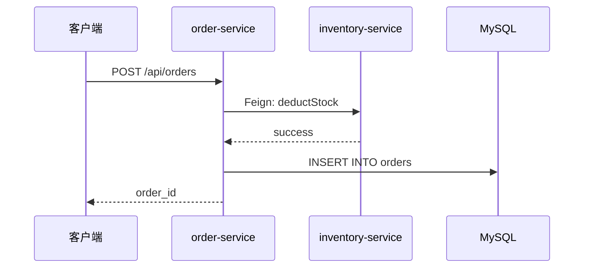

# 使用积木

学习如何查找和使用积木文件，快速理解业务流程。

## 使用场景

### 场景1：理解一个功能
新人或不熟悉的开发者需要理解某个功能的实现。

### 场景2：修改一个功能
需要修改某个功能，先理解现有流程再动手。

### 场景3：排查线上问题
线上出问题，需要快速定位可能出错的环节。

### 场景4：Code Review
Review 代码时，对照积木检查实现是否符合设计。

## 查找积木

### 方法1：通过索引查找（推荐）

打开 `.ai/blocks/_index.md`，按业务域查找：

```markdown
## 订单模块
- [创建订单](order_create.md) — 用户下单流程
- [支付订单](order_pay.md) — 订单支付流程
- [取消订单](order_cancel.md) — 订单取消流程
```

**适用场景**：知道大概的业务域，不确定具体的积木名称。

### 方法2：文件名搜索

```bash
cd .ai/blocks
ls | grep order
# 输出：order_create.md, order_pay.md, order_cancel.md
```

**适用场景**：知道关键词，快速定位。

### 方法3：全文搜索

```bash
cd .ai/blocks
grep -r "OrderService" .
# 输出：order_create.md:OrderService#createOrder
```

**适用场景**：知道类名或方法名，反查积木。

### 方法4：询问 Claude AI

```
你：创建订单的流程是怎样的？
Claude：让我查看 order_create 积木...
```

**适用场景**：不确定关键词，用自然语言描述。

## 阅读积木

### 第1步：看元信息

快速了解流程的基本信息：

```yaml
---
id: order_create
name: 创建订单
services: [api-gateway, order-service, inventory-service]
triggers: POST /api/v1/orders
status: stable
---
```

**关注点**：
- `services`：涉及哪些服务
- `triggers`：如何触发
- `status`：是否稳定

### 第2步：看流程图

理解服务间调用关系：



**关注点**：
- 调用顺序
- 同步/异步
- 数据流向

### 第3步：看节点逻辑

理解每个服务的处理细节：

```markdown
### order-service — 核心业务逻辑

**入口**：OrderService#createOrder
**锚点**：order-service/src/.../OrderService.java#createOrder

处理步骤：
1. 参数校验
2. 查询商品信息
3. 计算订单金额
4. 扣减库存
5. 创建订单实体
6. 持久化到数据库
```

**关注点**：
- 处理步骤
- 锚点（用于跳转代码）
- 依赖服务
- 写表/发事件

### 第4步：看异常路径

理解边界情况：

| 场景 | 处理 | 返回 |
|------|------|------|
| 库存不足 | 抛出 InsufficientStockException | "库存不足" |

**关注点**：
- 可能的异常
- 异常处理方式
- 返回信息

## 使用技巧

### 技巧1：从流程图开始

先看流程图，快速理解全局，再看节点逻辑了解细节。

### 技巧2：利用锚点跳转

根据锚点快速跳转到代码：
```
order-service/src/main/java/com/example/service/OrderService.java#createOrder
```

在 IDE 中：
1. 打开对应文件
2. 搜索方法名
3. 跳转到方法

### 技巧3：对照代码验证

积木可能过时，阅读时对照代码验证：
- 流程图是否准确
- 处理步骤是否完整
- 锚点是否正确

如果发现不一致，及时更新积木。

### 技巧4：关注变更记录

查看变更记录，了解流程演进：

```markdown
## 变更记录

- 2026-05-18: 新增库存扣减逻辑（MR-5678）
- 2026-05-14: 初始创建
```

**用途**：
- 了解最近的变更
- 追溯历史版本
- 找到相关 MR

## 常见问题

### Q: 积木和代码不一致怎么办？

A: 
1. 对照代码，确认哪个是正确的
2. 如果代码是对的，更新积木
3. 如果积木是对的，修复代码（可能是 bug）

### Q: 找不到我要的积木怎么办？

A: 可能的原因：
1. 积木还没创建 → 参考 [创建积木](01-create-block.md)
2. 积木名称不符合预期 → 全文搜索或问 Claude
3. 流程太简单，不需要积木 → 直接看代码

### Q: 积木太复杂，看不懂怎么办？

A: 
1. 先看流程图，理解全局
2. 再看节点逻辑，逐个服务理解
3. 对照代码，边看边理解
4. 问同事或 Claude

## 下一步

- [创建积木](01-create-block.md) — 学习如何创建积木
- [更新积木](02-update-block.md) — 学习如何维护积木
