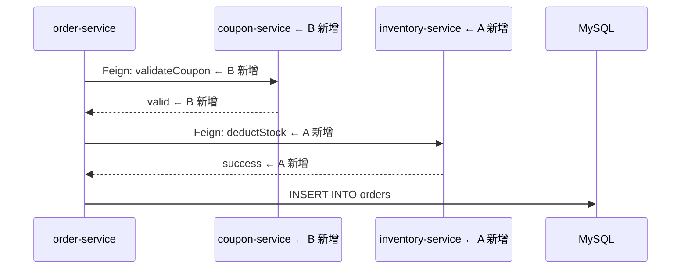

# 冲突解决

学习如何解决积木文件的合并冲突。

## 冲突场景

### 场景1：多人修改同一个积木

**情况**：A 和 B 同时修改 `order_create.md`

**原因**：
- A 新增了库存扣减
- B 新增了优惠券校验

**冲突位置**：
- 流程图
- 节点逻辑
- 变更记录

### 场景2：多人修改索引文件

**情况**：A 和 B 同时新增积木，都修改了 `_index.md`

**原因**：
- A 新增了 `order_refund.md`
- B 新增了 `order_cancel.md`

**冲突位置**：
- 索引文件的同一个模块

## 解决步骤

### 第1步：拉取最新代码

```bash
git fetch origin
git rebase origin/main
```

### 第2步：查看冲突文件

```bash
git status
# 输出：both modified: .ai/blocks/order_create.md
```

### 第3步：打开冲突文件

```markdown
<<<<<<< HEAD
处理步骤：
1. 参数校验
2. 查询商品信息
3. 计算订单金额
4. 扣减库存  ← A 的修改
5. 创建订单实体
=======
处理步骤：
1. 参数校验
2. 查询商品信息
3. 优惠券校验  ← B 的修改
4. 计算订单金额
5. 创建订单实体
>>>>>>> origin/main
```

### 第4步：合并变更

根据业务逻辑，合并两个人的修改：

```markdown
处理步骤：
1. 参数校验
2. 查询商品信息
3. 优惠券校验  ← B 的修改
4. 计算订单金额
5. 扣减库存  ← A 的修改
6. 创建订单实体
```

### 第5步：更新流程图

如果流程图也有冲突，同样合并：



### 第6步：合并变更记录

```markdown
## 变更记录

- 2026-05-18: 新增优惠券校验（MR-5678）  ← B 的修改
- 2026-05-18: 新增库存扣减逻辑（MR-5679）  ← A 的修改
- 2026-05-14: 初始创建
```

### 第7步：标记冲突已解决

```bash
git add .ai/blocks/order_create.md
git rebase --continue
```

### 第8步：推送代码

```bash
git push origin feature/add-inventory-deduction --force-with-lease
```

## 冲突解决原则

### 1. 业务优先

根据业务逻辑判断合并顺序，不是简单的先来后到。

### 2. 保留所有变更

除非明确冲突，否则保留双方的修改。

### 3. 沟通确认

如果不确定如何合并，与另一方沟通确认。

### 4. 测试验证

合并后运行测试，确保功能正常。

## 索引文件冲突

### 场景

A 和 B 同时新增积木，都修改了 `_index.md`：

```markdown
<<<<<<< HEAD
## 订单模块
- [创建订单](order_create.md)
- [订单退款](order_refund.md)  ← A 新增
=======
## 订单模块
- [创建订单](order_create.md)
- [取消订单](order_cancel.md)  ← B 新增
>>>>>>> origin/main
```

### 解决

保留双方的新增，按字母顺序排列：

```markdown
## 订单模块
- [创建订单](order_create.md)
- [取消订单](order_cancel.md)  ← B 新增
- [订单退款](order_refund.md)  ← A 新增
```

## 预防冲突

### 1. 及时同步

开发前先拉取最新代码：

```bash
git pull origin main
```

### 2. 小步提交

不要积累太多修改再提交，减少冲突概率。

### 3. 沟通协调

如果知道有人在修改同一个积木，提前沟通。

### 4. 分模块开发

不同模块的积木由不同人负责，减少冲突。
