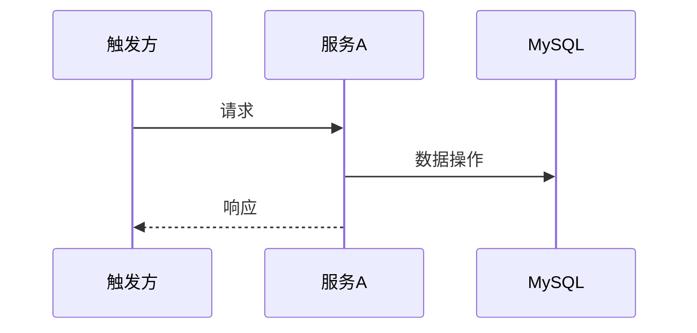

## 流程总览

## 节点逻辑

### {服务名} — {角色描述}

**入口**：`ClassName#methodName`
**锚点**：`{模块}/src/main/java/{path}#{method}`

处理步骤：
1.

**写表**：
**发事件**：

## 异常路径

| 场景 | 处理 | 返回 |
|------|------|------|
|      |      |      |

## 变更记录

- {YYYY-MM-DD}: 初始创建
