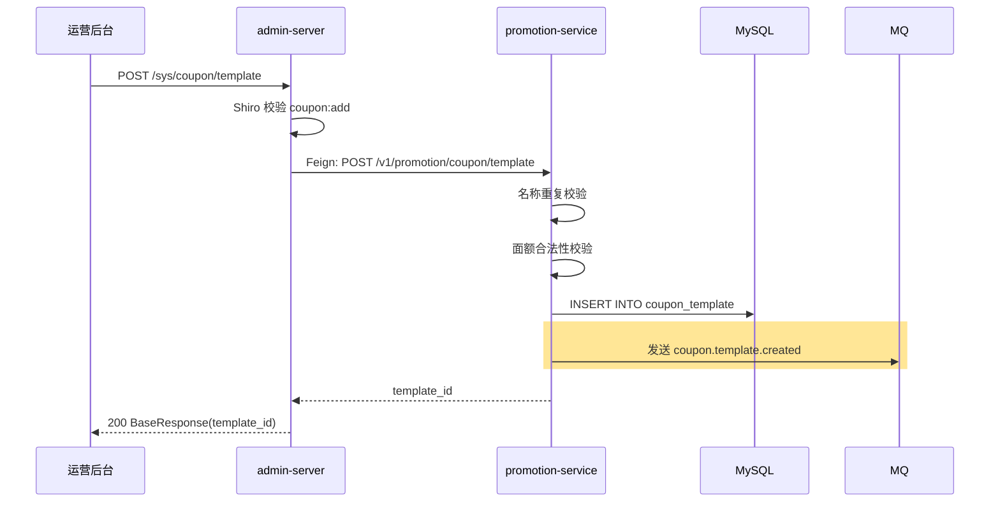

## 流程总览

## 节点逻辑

### admin-server — 鉴权与透传

**入口**：`AdminController#createCouponTemplate`
**锚点**：`admin-server/src/main/java/com/freshmart/controller/AdminController.java#createCouponTemplate`

处理步骤：
1. Shiro 注解 `@RequiresPermissions("coupon:add")` 鉴权
2. Feign 调用 promotion-service

**依赖服务**：
- `PromotionClient`（→ promotion-service）

---

### promotion-service — 模板创建

**入口**：`PromotionController#createTemplate`
**锚点**：`promotion-service/src/main/java/com/freshmart/controller/PromotionController.java#createTemplate`

**核心方法**：`CouponService#createTemplate`
**锚点**：`promotion-service/src/main/java/com/freshmart/service/CouponService.java#createTemplate`

**事务**：`@Transactional`

处理步骤：
1. 名称重复校验
2. 面额合法性校验（discountAmount < minOrderAmount）
3. 创建 `CouponTemplate` 实体（status=PENDING）
4. 持久化
5. 发 `coupon.template.created` 事件

**写表**：`coupon_template`
**发事件**：`coupon.template.created`（MQ）

## 异常路径

| 场景 | 处理 | 返回 |
|------|------|------|
| 券名称已存在 | 抛 ServiceException | "券名称已存在" |
| 面额 ≥ 最低使用金额 | 抛 ServiceException | "券面额不能大于等于最低使用金额" |
| 有效期非法（开始 > 结束） | 抛 ServiceException | "有效期不合法" |

## 变更记录

- 2026-05-23: 初始创建（MR-201）
