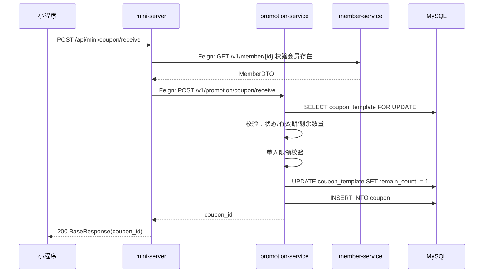

## 流程总览

## 节点逻辑

### mini-server — 会员校验 + 透传

**入口**：`MiniController#receiveCoupon`
**锚点**：`mini-server/src/main/java/com/freshmart/controller/MiniController.java#receiveCoupon`

处理步骤：
1. 调 member-service 校验会员是否存在
2. 调 promotion-service 领券

**依赖服务**：
- `MemberClient`（→ member-service）
- `PromotionClient`（→ promotion-service）

---

### promotion-service — 领券核心

**入口**：`PromotionController#receive`
**锚点**：`promotion-service/src/main/java/com/freshmart/controller/PromotionController.java#receive`

**核心方法**：`CouponService#receive`
**锚点**：`promotion-service/src/main/java/com/freshmart/service/CouponService.java#receive`

**事务**：`@Transactional`

处理步骤：
1. `findByIdForUpdate` 行锁查模板（防并发超发）
2. 校验状态 = ACTIVE，有效期内
3. 剩余数量 > 0
4. 单人限领校验（`countByMemberAndTemplate < maxPerUser`）
5. 模板剩余数量 -1
6. 创建用户券（status=UNUSED）

**写表**：`coupon_template`、`coupon`
**发事件**：无

## 异常路径

| 场景 | 处理 | 返回 |
|------|------|------|
| 模板不存在 | 抛 ServiceException | "券不存在" |
| 活动未开始/已结束 | 抛 ServiceException | "活动未开始或已结束" |
| 已抢光 | 抛 ServiceException | "券已抢光" |
| 已达单人领取上限 | 抛 ServiceException | "已达领取上限" |
| 会员不存在（mini-server 层） | 抛 ServiceException | "会员不存在" |

## 特殊说明

`findByIdForUpdate` 行锁是**防超发的关键**：高并发下不能去掉，否则会出现 `remain_count < 0`。

## 变更记录

- 2026-05-23: 初始创建（MR-202）
