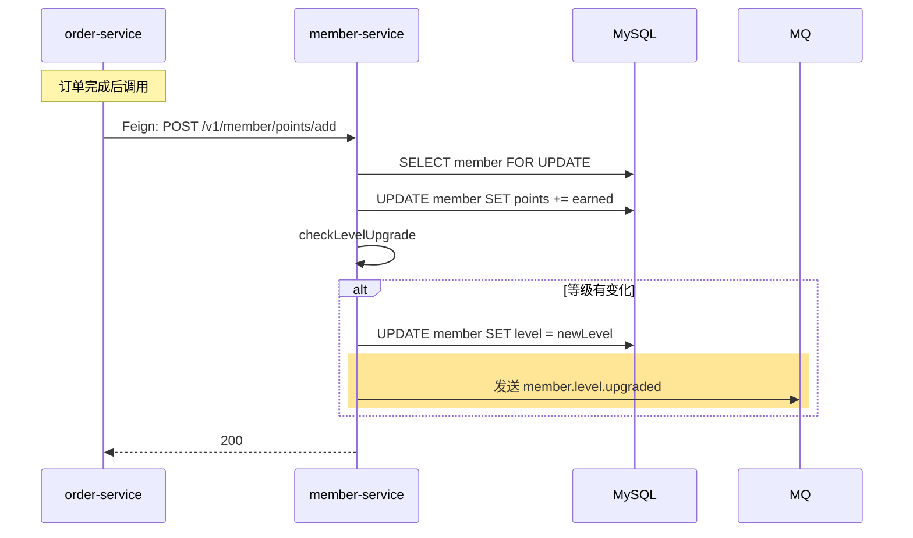

## 流程总览

## 节点逻辑

### member-service — 积分累加 + 等级判断

**入口**：`MemberController#addPoints`
**锚点**：`member-service/src/main/java/com/freshmart/controller/MemberController.java#addPoints`

**核心方法**：`MemberService#addPoints` → `MemberService#checkLevelUpgrade`
**锚点**：`member-service/src/main/java/com/freshmart/service/MemberService.java#addPoints`

**事务**：`@Transactional`

处理步骤：
1. `findByIdForUpdate` 行锁
2. 累加积分 + 落 `points_log`
3. `checkLevelUpgrade(m)`：根据新积分匹配等级表，若等级变了则更新并发事件

**写表**：`member`、`points_log`
**发事件**：`member.level.upgraded`（仅当等级变化）

## 异常路径

| 场景 | 处理 | 返回 |
|------|------|------|
| 会员不存在 | 抛 ServiceException | "会员不存在" |
| MQ 发送失败 | 不影响主事务（事件丢失，可由对账补偿） | 后台告警 |

## 特殊说明

升级**只升不降**——本积木不处理降级。降级由独立的定时任务积木处理（待实现）。

## 变更记录

- 2026-05-23: 初始创建（MR-103）
