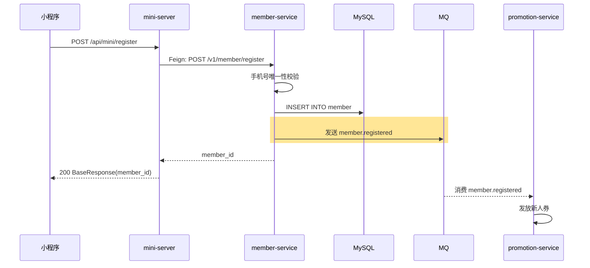

## 流程总览

## 节点逻辑

### mini-server — BFF 透传层

**入口**：`MiniController#register`
**锚点**：`mini-server/src/main/java/com/freshmart/controller/MiniController.java#register`

处理步骤：
1. 接收请求参数
2. Feign 调用 member-service

**依赖服务**：
- `MemberClient`（→ member-service）

---

### member-service — 注册核心

**入口**：`MemberController#register`
**锚点**：`member-service/src/main/java/com/freshmart/controller/MemberController.java#register`

**核心方法**：`MemberService#register`
**锚点**：`member-service/src/main/java/com/freshmart/service/MemberService.java#register`

**事务**：`@Transactional`

处理步骤：
1. 手机号唯一性校验（`existsByMobile`）
2. 创建会员记录（默认昵称 + 等级 NORMAL + 积分 0）
3. 持久化到数据库
4. 发送 `member.registered` 消息（promotion-service 消费后发新人券）

**写表**：`member`
**发事件**：`member.registered`（MQ）

## 异常路径

| 场景 | 处理 | 返回 |
|------|------|------|
| 手机号已注册 | 抛 ServiceException | "手机号已注册" |
| 数据库异常 | 事务回滚 | "系统繁忙，请重试" |
| MQ 发送失败 | 不影响注册（事务已提交） | 后台告警 |

## 变更记录

- 2026-05-23: 初始创建（MR-101）
