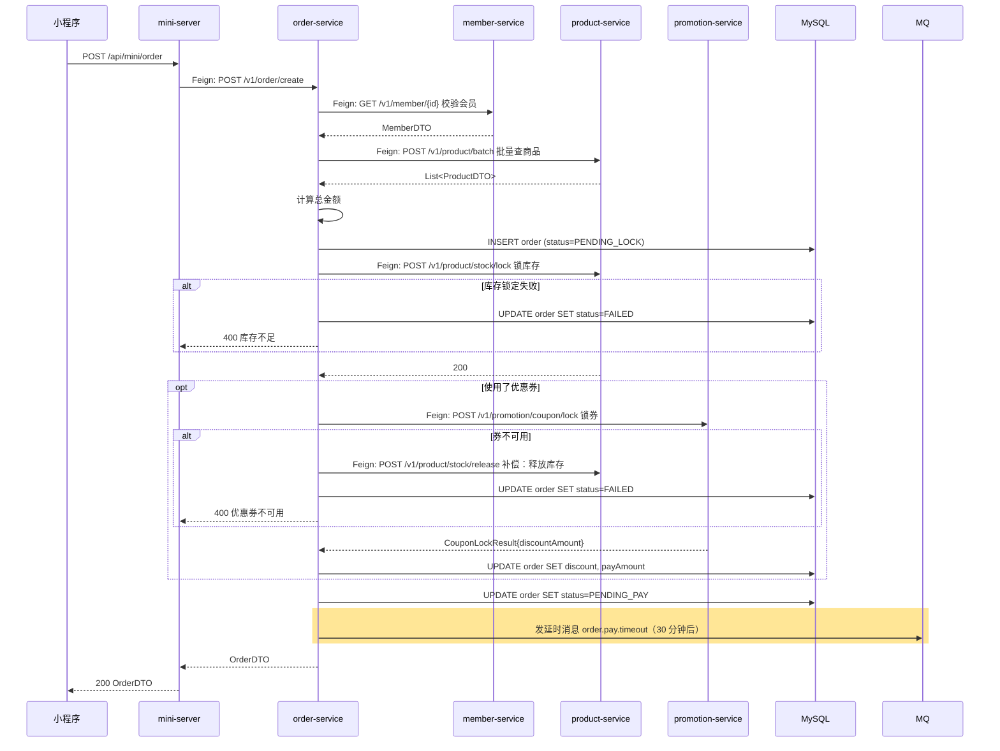

## 流程总览

## 节点逻辑

### mini-server — BFF 透传

**入口**：`MiniController#createOrder`
**锚点**：`mini-server/src/main/java/com/freshmart/controller/MiniController.java#createOrder`

处理步骤：
1. 鉴权（JWT 解出 memberId）
2. Feign 调用 order-service

**依赖服务**：
- `OrderClient`（→ order-service）

---

### order-service — 订单编排核心 ⭐

**入口**：`OrderController#create`
**锚点**：`order-service/src/main/java/com/freshmart/controller/OrderController.java#create`

**核心方法**：`OrderService#createOrder`
**锚点**：`order-service/src/main/java/com/freshmart/service/OrderService.java#createOrder`

**事务**：`@Transactional`（仅订单本地写操作；跨服务调用不在事务内）

处理步骤：
1. 调 member-service 校验会员
2. 调 product-service 批量查商品（拿价格、库存状态）
3. 计算订单总金额
4. 生成订单号 + INSERT 订单（status=PENDING_LOCK）
5. **调 product-service 锁库存** — 失败则订单状态置为 FAILED
6. **调 promotion-service 锁券**（如有）— 失败则**补偿调用 stock/release 释放已锁的库存**，订单 FAILED
7. 计算最终 payAmount = total - discount
8. 订单状态 → PENDING_PAY
9. 发 MQ 延时消息 `order.pay.timeout`（30 分钟）

**写表**：`order`、`order_item`
**发事件**：`order.pay.timeout`（延时 30 分钟）

**依赖服务**：
- `MemberClient`、`ProductClient`、`PromotionClient`

---

### product-service — 库存锁定

**入口**：`ProductController#lockStock`
**锚点**：`product-service/src/main/java/com/freshmart/controller/ProductController.java#lockStock`

**核心方法**：`ProductService#lockStock`

**事务**：`@Transactional`

处理步骤：
1. `findByProductIdForUpdate` 行锁（防超卖）
2. 校验 `available >= qty`
3. `available -= qty; locked += qty`
4. 写 `stock_lock` 记录（30 分钟超时时间）

**写表**：`stock`、`stock_lock`

---

### promotion-service — 优惠券锁定

**入口**：`PromotionController#lockCoupon`
**锚点**：`promotion-service/src/main/java/com/freshmart/controller/PromotionController.java#lockCoupon`

**核心方法**：`CouponService#lock`

处理步骤：
1. 行锁查券
2. 校验 status=UNUSED、未过期、订单金额≥最低使用金额
3. 状态置 LOCKED，记录 lockedOrderNo

**写表**：`coupon`

## 异常路径

| 场景 | 处理 | 返回 |
|------|------|------|
| 会员不存在 | 抛 ServiceException | "会员不存在" |
| 商品不存在 | 抛 ServiceException | "商品不存在" |
| **库存不足** | 订单 → FAILED；不需要补偿 | "商品 X 库存不足" |
| **券不可用**（已用/过期/未达门槛）| **补偿：释放已锁库存**；订单 → FAILED | "优惠券不可用：xxx" |
| 30 分钟未支付 | MQ 触发取消，释放库存与券 | 用户重新下单 |

## 分布式一致性边界

本流程是 vibe-blocks 体系展示**try-compensate 模式**的典型案例：

1. **try 阶段**：锁库存、锁券（不真正扣减）
2. **支付成功**（见 `order_pay`）：locked → sold（真正扣减）
3. **超时未支付**：MQ 触发取消，回滚 locked → available

**禁止**直接 XA 跨库事务。

## 变更记录

- 2026-05-23: 初始创建（MR-301）
