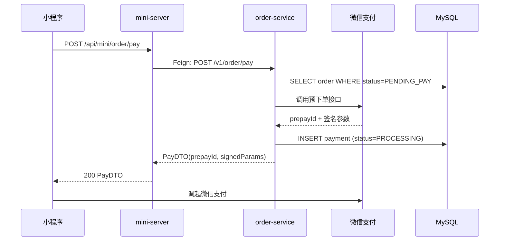
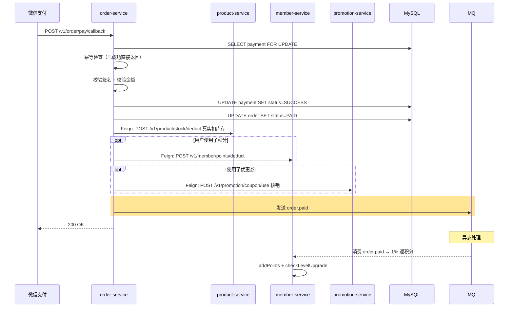

## 流程总览

### Phase 1: 发起支付



### Phase 2: 支付回调（关键流程，跨 4 服务）



## 节点逻辑

### Phase 1 — 发起支付

**入口**：`OrderController#pay`
**锚点**：`order-service/src/main/java/com/freshmart/controller/OrderController.java#pay`

**核心方法**：`PaymentService#pay`
**锚点**：`order-service/src/main/java/com/freshmart/service/PaymentService.java#pay`

处理步骤：
1. 查订单，校验 status=PENDING_PAY
2. 调微信预下单接口拿 prepayId
3. 写 `payment` 表（status=PROCESSING）
4. 返回 prepayId 和签名参数给前端

**写表**：`payment`

---

### Phase 2 — 微信回调 ⭐⭐ 核心复杂流程

**入口**：`OrderController#payCallback`
**锚点**：`order-service/src/main/java/com/freshmart/controller/OrderController.java#payCallback`

**核心方法**：`PaymentService#onPaySuccess`
**锚点**：`order-service/src/main/java/com/freshmart/service/PaymentService.java#onPaySuccess`

**事务**：`@Transactional`（订单本地写在事务内；跨服务调用不在事务内）

处理步骤（**8 步必须按序**）：
1. **幂等**：行锁查 payment，已 SUCCESS 直接返回（微信会重发）
2. **签名校验**：`wxPayClient.verifySign(callback)`
3. **金额校验**：`callback.totalFee == toCents(p.amount)`
4. **payment 状态置 SUCCESS**
5. **订单状态置 PAID**
6. **调 product-service `stock/deduct`**：locked → sold 真正扣减
7. **调 member-service `points/deduct`**（如使用了积分抵扣）
8. **调 promotion-service `coupon/use`**（如使用了券）核销
9. **发 `order.paid` MQ 消息** — 触发返积分、发通知等异步流程

**写表**：`payment`、`order`
**发事件**：`order.paid`（MQ）

**依赖服务**：
- `WxPayClient`、`ProductClient`、`MemberClient`、`PromotionClient`

---

### 异步消费方：member-service（返积分）

**入口**：`OrderPaidListener#onMessage`（伪）
**锚点**：`member-service/src/main/java/com/freshmart/listener/OrderPaidListener.java#onMessage`

处理步骤：
1. 消费 `order.paid` 消息
2. 计算返积分（订单金额 1%，向下取整）
3. 调 `MemberService#addPoints` 增加积分
4. `addPoints` 内部触发 `checkLevelUpgrade`（见积木 [member_level_upgrade](member_level_upgrade.md)）

**写表**：`member`、`points_log`
**发事件**：`member.level.upgraded`（仅当等级变化）

## 异常路径

| 场景 | 处理 | 返回 |
|------|------|------|
| 订单状态不是 PENDING_PAY | 抛 ServiceException | "订单状态不允许支付" |
| 微信预下单失败 | 抛 ServiceException | 微信错误信息 |
| **回调签名错误** | 抛 ServiceException | "签名校验失败"（不更新任何状态） |
| **回调金额不一致** | 抛 ServiceException | "金额不一致"（疑似伪造） |
| **重复回调** | 幂等返回 | 200 OK |
| 扣库存失败（不可能，已锁定）| 告警，人工介入 | 微信侧标记成功，业务侧异常 |
| 扣积分失败 | 重试 3 次，仍失败则降级（积分由对账补） | 不影响支付主流程 |

## 特殊说明

**为什么扣库存/积分/券放在回调里、不在发起支付时？**

支付成功是**最终态**才能扣资源。如果支付前就扣，用户取消支付时还要回滚，复杂度高。

**为什么返积分用 MQ 异步？**

支付回调要在 5 秒内响应微信（否则微信会重试），返积分 + 等级判断逻辑较重，放异步避免回调超时。

## 与 order_create 的关系

```
order_create  →  锁库存、锁券（try）
order_pay     →  扣库存、用券（confirm）
order_refund  →  退库存、退券（cancel）
```

## 变更记录

- 2026-05-23: 初始创建（MR-302）
