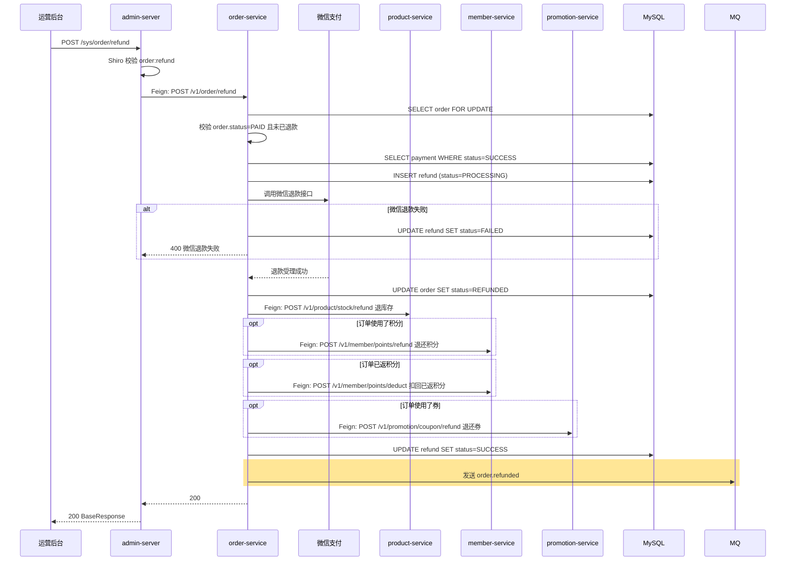

## 流程总览



## 节点逻辑

### admin-server — 鉴权透传

**入口**：`AdminController#refundOrder`
**锚点**：`admin-server/src/main/java/com/freshmart/controller/AdminController.java#refundOrder`

处理步骤：
1. Shiro `@RequiresPermissions("order:refund")` 校验
2. Feign 调 order-service

---

### order-service — 退款编排核心 ⭐⭐⭐ 最复杂流程

**入口**：`OrderController#refund`
**锚点**：`order-service/src/main/java/com/freshmart/controller/OrderController.java#refund`

**核心方法**：`RefundService#applyRefund`
**锚点**：`order-service/src/main/java/com/freshmart/service/RefundService.java#applyRefund`

**事务**：`@Transactional`（本地写操作；跨服务调用不在事务）

处理步骤（**9 步必须按序**）：
1. 查订单 + 校验 status=PAID
2. 校验未已退款（防重）
3. 查成功的 payment 记录拿 prepayId
4. 创建 refund 记录（status=PROCESSING）
5. **调微信退款接口** — 失败则 refund=FAILED 并抛异常
6. 订单状态置 REFUNDED
7. **调 product-service `stock/refund`** — 退回库存（sold → available）
8. **调 member-service**：
   - 已扣积分 → `points/refund` 退还
   - 已返积分 → `points/deduct` 扣回
9. **调 promotion-service `coupon/refund`** — 退还券（仅当未过期）
10. refund 状态置 SUCCESS
11. 发 `order.refunded` MQ 消息

**写表**：`refund`、`order`
**发事件**：`order.refunded`（MQ）

**依赖服务**：
- `WxPayClient`、`ProductClient`、`MemberClient`、`PromotionClient`

---

### product-service — 退库存

**入口**：`ProductController#refundStock`
**锚点**：`product-service/src/main/java/com/freshmart/controller/ProductController.java#refundStock`

**核心方法**：`ProductService#refundStock`

处理步骤：
1. 按订单号查历史 stock 快照
2. `available += qty; sold -= qty`

**写表**：`stock`

---

### member-service — 积分退还/扣回

**入口**：`MemberController#refundPoints` / `MemberController#deductPoints`
**锚点**：`member-service/src/main/java/com/freshmart/controller/MemberController.java`

处理步骤：行锁 + 增减积分 + 落 `points_log`

**写表**：`member`、`points_log`

---

### promotion-service — 券退还

**入口**：`PromotionController#refundCoupon`
**核心方法**：`CouponService#refund`

处理步骤：
1. 按 lockedOrderNo 查券
2. 仅当券未过期才退还（`status=UNUSED`，清空 lockedOrderNo）
3. 已过期的券**不退**（业务约定）

**写表**：`coupon`

## 异常路径

| 场景 | 处理 | 返回 |
|------|------|------|
| 订单不存在 | 抛 ServiceException | "订单不存在" |
| 订单状态非 PAID | 抛 ServiceException | "订单状态不允许退款" |
| **重复退款** | refund 表唯一索引校验 | "订单已申请退款" |
| **微信退款失败** | refund=FAILED，订单不变 | 微信错误信息 |
| **退库存/积分/券任一失败** | 记录到对账表，人工补偿 | 退款主流程已完成 |
| 已返积分 > 当前余额 | 允许积分变负，对账补 | 不抛异常 |

## 特殊说明

**为什么微信退款失败要回滚 refund，但后续步骤失败不回滚？**

- 微信侧失败：钱没退出去，必须中止
- 其他步骤失败：钱已经退了，业务侧问题不能回滚（只能人工或对账修）

**为什么券过期了不退？**

业务约定：券是**激励工具**，过期后失去价值。退过期券会形成漏洞（用户故意延迟退款抢限时折扣）。

**与 order_pay 的对称性**：

```
order_pay      stock/deduct + points/deduct + coupon/use
order_refund   stock/refund + points/refund + coupon/refund
                              + 已返积分要 deduct
```

## 与其他积木的关系

- 入口由运营触发 → 见积木 [coupon_create](coupon_create.md)（这条流程动用的资源都是 order_pay 已扣的）
- 触发 `order.refunded` 后由 `notification-service` 消费发短信通知用户（待实现）

## 变更记录

- 2026-05-23: 初始创建（MR-303）
