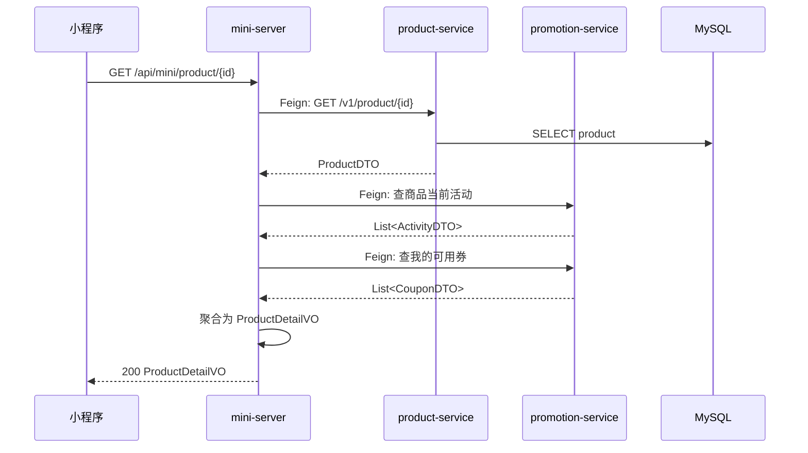

## 流程总览

## 节点逻辑

### mini-server — BFF 聚合层

**入口**：`MiniController#productDetail`
**锚点**：`mini-server/src/main/java/com/freshmart/controller/MiniController.java#productDetail`

处理步骤：
1. 透传 productId 调 product-service 拿基础信息
2. 调 promotion-service 查该商品参与的活动
3. 调 promotion-service 查当前用户可用的优惠券（用 `X-Member-Id` header）
4. 在 BFF 层聚合为 `ProductDetailVO` 返回前端

**依赖服务**：
- `ProductClient`（→ product-service）
- `PromotionClient`（→ promotion-service）

---

### product-service — 商品查询

**入口**：`ProductController#detail`
**锚点**：`product-service/src/main/java/com/freshmart/controller/ProductController.java#detail`

**核心方法**：`ProductService#findById`
**锚点**：`product-service/src/main/java/com/freshmart/service/ProductService.java#findById`

处理步骤：
1. 按 ID 查商品
2. 不存在则抛异常

**写表**：无（只读）

## 异常路径

| 场景 | 处理 | 返回 |
|------|------|------|
| 商品不存在 | 抛 ServiceException | "商品不存在" |
| 活动查询失败 | 降级为空数组 | 商品基础信息正常返回 |

## 特殊说明

BFF 层聚合是这条流程的核心，**禁止把"查活动""查券"的逻辑下沉到 product-service**——会形成跨域耦合。

## 变更记录

- 2026-05-23: 初始创建（MR-102）
